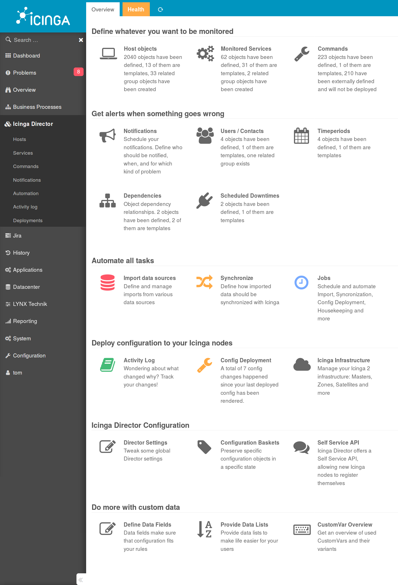

Icinga Director
===============

Icinga Director has been designed to make Icinga 2 configuration handling easy.
It tries to target two main audiences:

* Users with the desire to completely automate their datacenter
* Sysops willing to grant their "point & click" users a lot of flexibility

What makes Icinga Director so special is the fact that it tries to target both
of them at once.

Learn more about the Director in the documentation:

* [Introduction](doc/01-Introduction.md)
* [Installation](doc/02-Installation.md)
* [Automation](doc/03-Automation.md)
* [Getting started](doc/04-Getting-started.md) 
* [Import and Synchronization](doc/70-Import-and-Sync.md)
* [CLI interface](doc/60-CLI.md)
* [REST API](doc/70-REST-API.md) 
* [FAQ](doc/80-FAQ.md)

