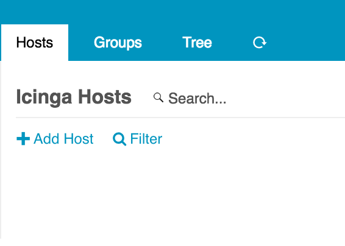
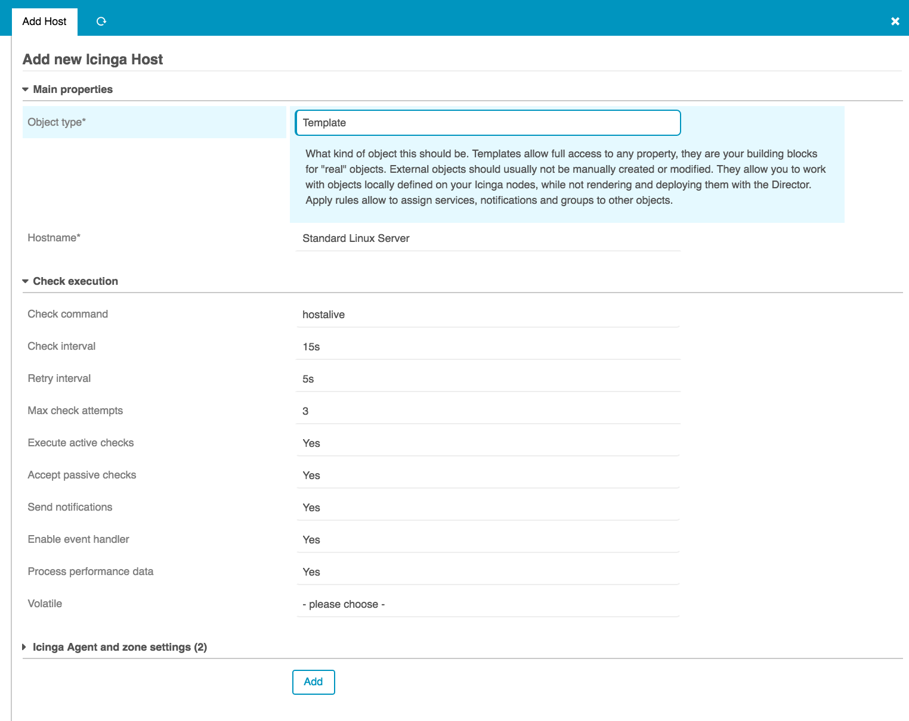
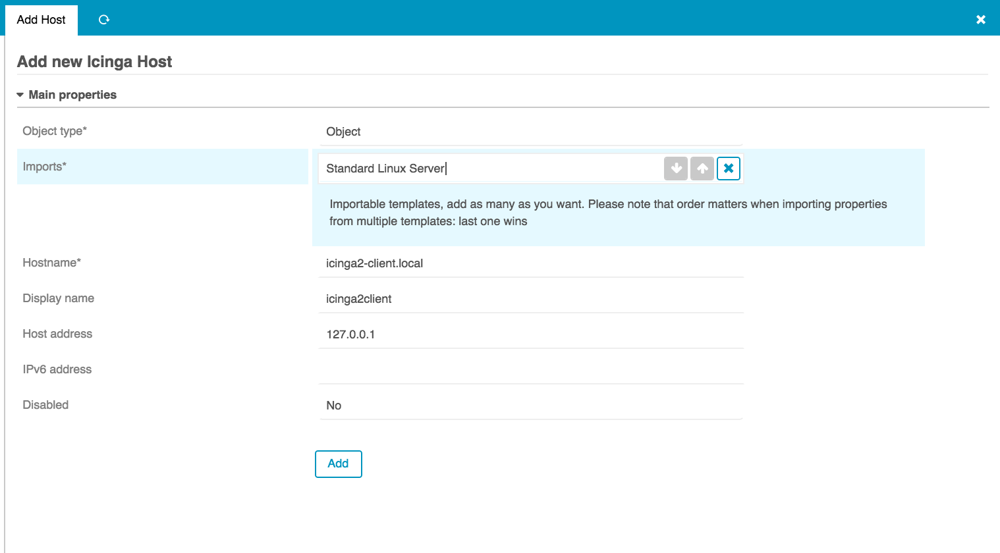

Preparing your Icinga 2 environment for the Director
====================================================

Create an API user
------------------

```icinga2
object ApiUser "director" {
  password = "***"
  permissions = [ "*" ]
  //client_cn = ""
}
```

To allow the configuration of an API user your Icinga 2 instance needs a
`zone` and an `endpoint` object for itself. If you have a clustered
setup or you are using agents you already have this. If you are using a
fresh Icinga 2 installation or a standalone setup with other ways of
checking your clients, you will have to create them.

The easiest way to set up Icinga 2 with a `zone` and `endpoint` is by
running the [Icinga 2 Setup Wizard](http://docs.icinga.org/icinga2/latest/doc/module/icinga2/chapter/icinga2-client#icinga2-client-installation-master-setup).

Start with a new, empty Icinga setup. Director is not allowed to modify
existing configuration in `/etc/icinga2`, and while importing existing
config is possible (happens for example automagically at kickstart time)
this is an advanced task you should not tackle at the early beginning.

Take some time to really understand how to work with Icinga Director first.

First steps on the Frontend
====================================
Create a host
------------------

First we create a `host template` which we will name `director-generic-host`. The default check we will use for a Host is `hostalive`.

Click on the interface on Icinga Director > Host Objects > Add Host and `add a template`. For details have a look at the screenshots below:





Now we can add our first host. Go to Icinga Director > Host Objects > Add Host and choose `Object`:



Deploy your Config
------------------

It is time to deploy our first configuration. Click on 
Deployments/ History > Render config > Deploy to master


Working with Agents and Config Zones
====================================

Hint: Large: max packet size
