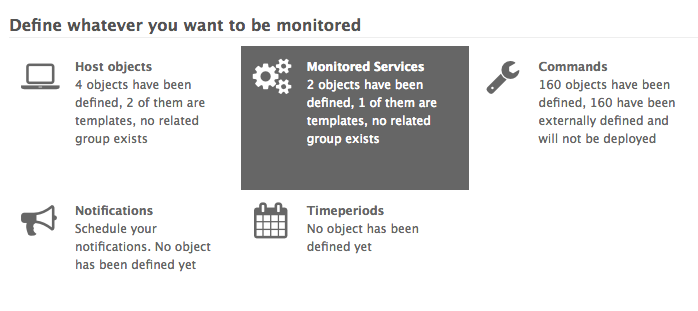
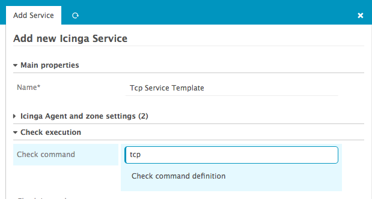
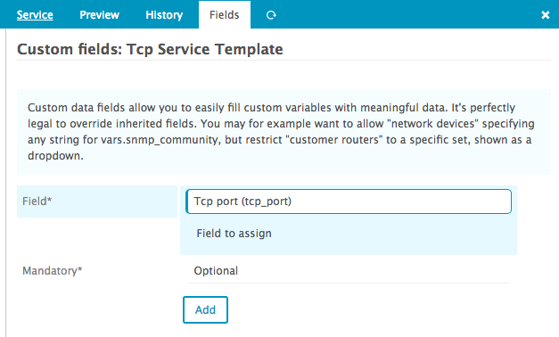
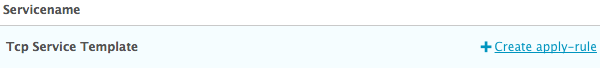
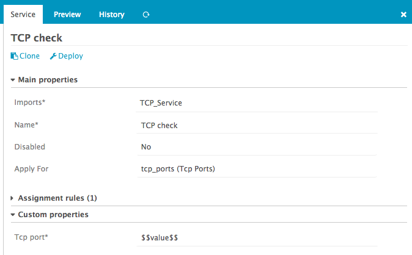
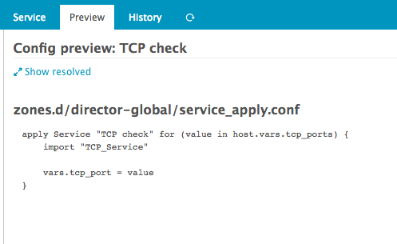

<a id="Service-apply-for-example"></a>Working with Apply for rules - tcp ports example
==============================================

This example walks you through using an `Apply For` rule to spin up services
automatically, using open TCP ports as the example.

> `Apply For` also works with the newer [Custom Variables](12-Handling-custom-variables.md)
> of type `dynamic-array` and `dynamic-dictionary`, which is the recommended way to go
> since it also supports iterating over dictionaries. See
> [Apply For with Custom Variables](#Apply-For-with-Custom-Variables) below. The
> walk-through that follows still uses the deprecated `Data fields`.

First, define a `tcp_ports` data field of type `Array` and assign it to a `Host Template`.
See [Working with fields](14-Fields-example-interfaces-array.md) if you need a refresher on
setting up a data field. You'll also need a `tcp_port` data field of type `String`, which we'll
associate with a `Service Template` later.

Then, please go to the `Dashboard` and choose the `Monitored services` dashlet:



Then create a new `Service template` with check command `tcp`:



Then associate the data field `tcp_port` to this `Service template`:



Then create a new `apply-rule` for the `Service template`:



Now set the `Apply For` property to the `tcp_ports` field you defined earlier on the host template.
An `Apply For` rule exposes a variable named `value`, usable as `$value$`, which corresponds to
whichever array item is currently being iterated over.

Set the `Tcp port` property to `$value$`:



(Side note: if you can't see your `tcp_ports` property in `Apply For` dropdown, try to create one 
host with a non-empty `tcp_ports` value.)

That's it. Every host that defines a `tcp_ports` variable will now get the `Tcp Check` service
assigned automatically.

Take a look at the config preview to see how the `Apply For` services will render once deployed:



<a id="Apply-For-with-Custom-Variables"></a>
Apply For with Custom Variables
--------------------------------

The [Custom Variables](12-Handling-custom-variables.md) system offers the same `Apply For`
mechanism, but isn't limited to flat arrays. A `dynamic-array` custom variable behaves just like
the `tcp_ports` example above, while a `dynamic-dictionary` custom variable also gives you the
dictionary key of each iterated entry, plus direct access to its sub-dictionary fields.

Only `dynamic-array` and `dynamic-dictionary` custom variables that are attached to a **Host
Template** show up in the `Apply For` dropdown of a service apply rule.

### Example: Apply For over a `dynamic-array`

**Scenario:** a host has a `dynamic-array` custom variable `http_vhosts_list` listing virtual host
addresses to probe. A service apply rule creates one HTTP check per entry.

1. Under `Custom Variables`, create a property `http_vhosts_list` of type `Dynamic Array` with item
   type `String`.
2. On the `Host Template`, open the `Custom Variables` tab and add `http_vhosts_list`.
3. On a host importing that template, fill in the values:

   ```
   vars.http_vhosts_list = [
       "www.example.com",
       "api.example.com",
       "status.example.com"
   ]
   ```

4. Create a `Service Template` with `check_command = http`, and its own custom variable
   `http_address` (type `String`).
5. Create an `Apply Rule` for that template, set `Apply For` to `http_vhosts_list`, the service
   name pattern to `http - $value$`, and `http_address` to `$value$`.

The rendered configuration looks like:

```
apply Service "http - " for (value in host.vars.http_vhosts_list) {
    check_command     = "http"
    vars.http_address = value

    assign where host.vars.http_vhosts_list
}
```

Three services are created on that host: `http - www.example.com`, `http - api.example.com` and
`http - status.example.com`.

### Example: Apply For over a `dynamic-dictionary`

**Scenario:** a host has a `dynamic-dictionary` custom variable `disk_checks`, where each key is a
disk label and the value is a structured sub-dictionary with threshold fields. A service apply rule
creates one disk check per entry.

1. Under `Custom Variables`, create a property `disk_checks` of type `Dynamic Dictionary`. On its
   detail page, add the sub-dictionary fields `disk_partition`, `disk_wfree` and `disk_cfree`
   (type `String`).
2. Attach `disk_checks` to the `Host Template`'s `Custom Variables` tab.
3. On the host (or, thanks to dictionary merging, spread across several imported templates), fill
   in the entries:

   ```
   vars.disk_checks += {
       "root" = {
           disk_partition = "/"
           disk_wfree     = "20%"
           disk_cfree     = "10%"
       }
       "data" = {
           disk_partition = "/data"
           disk_wfree     = "15%"
           disk_cfree     = "5%"
       }
   }
   ```

4. Create a `Service Template` with `check_command = disk` and custom variables `disk_partitions`,
   `disk_wfree`, `disk_cfree` (type `String`).
5. Create an `Apply Rule`, set `Apply For` to `disk_checks`, the service name pattern to
   `disk - $key$`, and the custom variables to:

   | Variable            | Value                     |
   |----------------------|---------------------------|
   | `disk_partitions`   | `$value.disk_partition$`  |
   | `disk_wfree`        | `$value.disk_wfree$`      |
   | `disk_cfree`        | `$value.disk_cfree$`      |

   The `Apply For` page shows a hint listing all `$value.<field>$` (or `$value["field-name"]$` for
   field names that aren't valid identifiers) expressions available for the selected dictionary.

The rendered configuration looks like:

```
apply Service "disk - " for (key => value in host.vars.disk_checks) {
    check_command         = "disk"
    vars.disk_partitions  = value.disk_partition
    vars.disk_wfree       = value.disk_wfree
    vars.disk_cfree       = value.disk_cfree

    assign where host.vars.disk_checks
}
```

Two services are created: `disk - root` (checking `/`) and `disk - data` (checking `/data`).
Because `disk_checks` is merged with `+=` across the inheritance chain, further disk entries can be
added on a child template or on the host itself without losing entries defined further up the
template tree.
