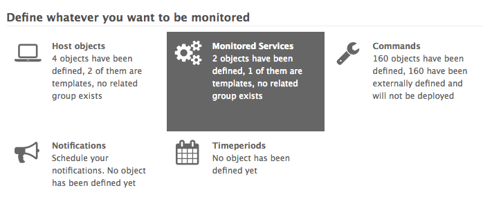
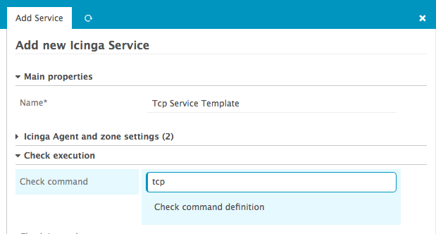
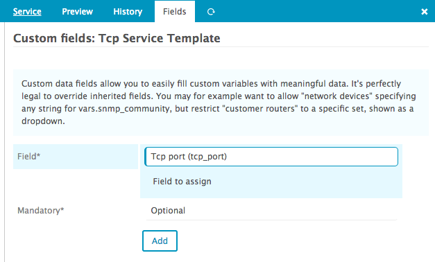
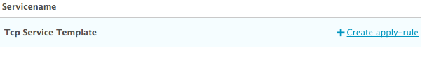
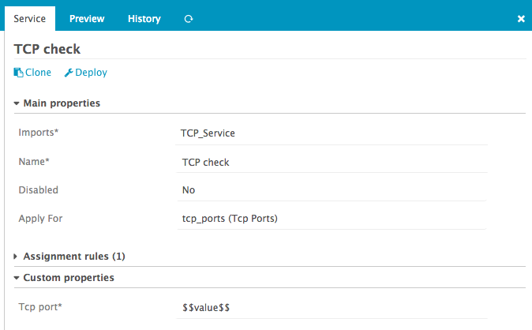
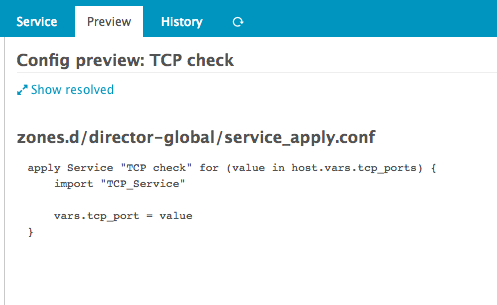

<a id="Service-apply-for-example"></a>Working with Apply for rules - tcp ports example
==============================================

This example walks you through using an `Apply For` rule to spin up services
automatically, using open TCP ports as the example.

> `Apply For` also works with the newer [Custom Variables](12-Handling-custom-variables.md)
> of type `dynamic-array` and `dynamic-dictionary`, which is the recommended way to go
> since it also supports iterating over dictionaries. See
> [Apply For with Custom Variables](#Apply-For-with-Custom-Variables) below. The
> walk-through that follows still uses the deprecated `Data fields`.

First, define a `tcp_ports` data field of type `Array` and assign it to a `Host Template`.
See [Working with fields](14-Fields-example-interfaces-array.md) if you need a refresher on
setting up a data field. You'll also need a `tcp_port` data field of type `String`, which we'll
associate with a `Service Template` later.

Then, please go to the `Dashboard` and choose the `Monitored services` dashlet:



Then create a new `Service template` with check command `tcp`:



Then associate the data field `tcp_port` to this `Service template`:



Then create a new `apply-rule` for the `Service template`:



Now set the `Apply For` property to the `tcp_ports` field you defined earlier on the host template.
An `Apply For` rule exposes a variable named `value`, usable as `$value$`, which corresponds to
whichever array item is currently being iterated over.

Set the `Tcp port` property to `$value$`:



(Side note: if you can't see your `tcp_ports` property in `Apply For` dropdown, try to create one 
host with a non-empty `tcp_ports` value.)

That's it. Every host that defines a `tcp_ports` variable will now get the `Tcp Check` service
assigned automatically.

Take a look at the config preview to see how the `Apply For` services will render once deployed:



<a id="Apply-For-with-Custom-Variables"></a>
Apply For with Custom Variables
--------------------------------

The [Custom Variables](12-Handling-custom-variables.md) system offers the same `Apply For`
mechanism, but isn't limited to flat arrays. A `dynamic-array` custom variable behaves just like
the `tcp_ports` example above, while a `dynamic-dictionary` custom variable also gives you the
dictionary key of each iterated entry, plus direct access to its sub-dictionary fields.

Only `dynamic-array` and `dynamic-dictionary` custom variables that are attached to a **Host
Template** show up in the `Apply For` dropdown of a service apply rule.

### Example: Apply For over a `dynamic-array`

**Scenario:** a host has a `dynamic-array` custom variable `http_vhosts_list` listing virtual host
addresses to probe. A service apply rule creates one HTTP check per entry.

1. Under `Custom Variables`, create a property `http_vhosts_list` of type `Dynamic Array` with item
   type `String`.
2. On the `Host Template`, open the `Custom Variables` tab and add `http_vhosts_list`.
3. On a host importing that template, fill in the values:

   ```
   vars.http_vhosts_list = [
       "www.example.com",
       "api.example.com",
       "status.example.com"
   ]
   ```

4. Create a `Service Template` named `http-template` with `check_command = http`, and its own
   custom variable `http_address` (type `String`).
5. Create an `Apply Rule` importing `http-template`, set `Apply For` to `http_vhosts_list`, and
   the assign filter to `host.vars.http_vhosts_list`. Leave the service name and `http_address`
   at their defaults for now.

Right after creating it, before setting a name pattern or filling in `http_address`, the `Preview`
tab shows a plain, literal name inline on the `apply Service` line, no separate `name` line, and
nothing between `assign where` and `import DirectorOverrideTemplate`:

```
apply Service "http-check" for (value in host.vars.http_vhosts_list) {

    vars.overriddenVar = "http-check"
    import "http-template"

    assign where host.vars.http_vhosts_list == 1

    import DirectorOverrideTemplate
}
```

6. Now set the service name pattern to `http - $value$` and `http_address` to `$value$`.

Because the name pattern contains a `$value$` macro, Icinga Director cannot render it as a
literal, inline service name anymore. It renders it as a computed `name` expression instead, right
after the `for (...)` clause. `check_command` still isn't repeated here, it comes from the
imported `http-template`:

```
apply Service for (value in host.vars.http_vhosts_list) {
    name = "http - " + value

    vars.overriddenVar = "http - \$value\$"
    import "http-template"

    assign where host.vars.http_vhosts_list == 1
    vars.http_address = value

    import DirectorOverrideTemplate
}
```

`import DirectorOverrideTemplate` is appended to every Apply Rule, Custom Variable based or not,
it's what makes the optional "Override vars for inherited/applied Services" feature (see
[REST API](70-REST-API.md)) work at all. `vars.overriddenVar` is the Custom-Variable-specific part
of that same mechanism: since the rendered service name varies with each iteration, Director keeps
the original, un-evaluated name pattern around in this variable so that template can still look up
per-iteration overrides by name. It's added to every Apply For rule bound to a Custom Variable,
whether or not its name pattern contains a macro. You can ignore both if you don't use per-service
overrides.

Three services are created on that host: `http - www.example.com`, `http - api.example.com` and
`http - status.example.com`.

### Example: Apply For over a `dynamic-dictionary`

**Scenario:** a host has a `dynamic-dictionary` custom variable `disk_checks`, where each key is a
disk label and the value is a structured sub-dictionary with threshold fields. A service apply rule
creates one disk check per entry.

1. Under `Custom Variables`, create a property `disk_checks` of type `Dynamic Dictionary`. On its
   detail page, add the sub-dictionary fields `disk_partition`, `disk_wfree` and `disk_cfree`
   (type `String`).
2. Attach `disk_checks` to the `Host Template`'s `Custom Variables` tab.
3. On the host (or, thanks to dictionary merging, spread across several imported templates), fill
   in the entries:

   ```
   vars.disk_checks += {
       "root" = {
           disk_partition = "/"
           disk_wfree     = "20%"
           disk_cfree     = "10%"
       }
       "data" = {
           disk_partition = "/data"
           disk_wfree     = "15%"
           disk_cfree     = "5%"
       }
   }
   ```

4. Create a `Service Template` named `disk-template` with `check_command = disk` and custom
   variables `disk_partitions`, `disk_wfree`, `disk_cfree` (type `String`).
5. Create an `Apply Rule` importing `disk-template`, set `Apply For` to `disk_checks`, and the
   assign filter to `host.vars.disk_checks`. Leave the service name and the custom variables
   below at their defaults for now.

Just like in the array example above, the plain, just-created rule renders with a literal name
inline, no `name` line, and nothing between `assign where` and `import DirectorOverrideTemplate`:

```
apply Service "disk-check" for (key => value in host.vars.disk_checks) {

    vars.overriddenVar = "disk-check"
    import "disk-template"

    assign where host.vars.disk_checks == 1

    import DirectorOverrideTemplate
}
```

6. Now set the service name pattern to `disk - $key$`, and the custom variables to:

   | Variable            | Value                     |
   |----------------------|---------------------------|
   | `disk_partitions`   | `$value.disk_partition$`  |
   | `disk_wfree`        | `$value.disk_wfree$`      |
   | `disk_cfree`        | `$value.disk_cfree$`      |

   The `Apply For` page shows a hint listing all `$value.<field>$` (or `$value["field-name"]$` for
   field names that aren't valid identifiers) expressions available for the selected dictionary.

   > Field names containing a quote, backslash, or dollar sign aren't supported in
   > `$value["field-name"]$` interpolation. They aren't escaped, and can produce
   > invalid or unexpected config. Avoid those characters in field names used this way.

The `$key$` macro in the name pattern now forces Icinga Director to render `name` as a separate
computed expression rather than an inline string; `check_command` still comes from the imported
`disk-template` rather than being repeated on the apply rule. Custom variables render in
alphabetical order by name, not the order you entered them in:

```
apply Service for (key => value in host.vars.disk_checks) {
    name = "disk - " + key

    vars.overriddenVar = "disk - \$key\$"
    import "disk-template"

    assign where host.vars.disk_checks == 1
    vars.disk_cfree = value.disk_cfree
    vars.disk_partitions = value.disk_partition
    vars.disk_wfree = value.disk_wfree

    import DirectorOverrideTemplate
}
```

Two services are created: `disk - root` (checking `/`) and `disk - data` (checking `/data`).
Because `disk_checks` is merged with `+=` across the inheritance chain, further disk entries can be
added on a child template or on the host itself without losing entries defined further up the
template tree.
