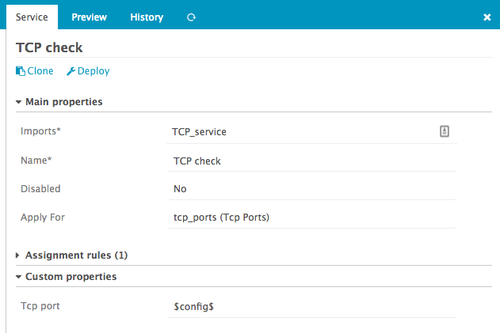

Working with Apply for rules - tcp ports example
==============================================

This example wants to show you how to make use of `Apply For` rule for services.

First you need to define a `tcp_ports` data field of type `Array` assigned to a `Host Template`. 
Refer to [Working with fields](14-Fields-example-interfaces-array.md) section to setup a data field.
You also need to define a `tcp_port` data field of type `String`, we will associate it to a
`Service Template` later.

Then, please got to the `Dashboard` and choose the `Monitored services` dashlet:

Then create a new `Service template` with check command `tcp`:

Then associate the data field `tcp_port` to this `Service template`:

Then create a new `apply-rule` for the `Service template`:

Now define the `Apply For` property, select the previously defined field `tcp_ports` associated to
the host template. `Apply For` rule define a variable `config` that can be used as `$config$`, it 
corresponds to the item of the array it will iterate on. 

Set the `Tcp port` property to `$config$`:

(Side note: if you can't see your `tcp_ports` property in `Apply For` dropdown, try to create one 
host with a non-empty `tcp_ports` value.)

That's it, now all your hosts defining a `tcp_ports` variable will be assigned the `Tcp Check`
service.

Have a look at the config preview, it will show you how `Apply For` services will look like once 
deployed:

