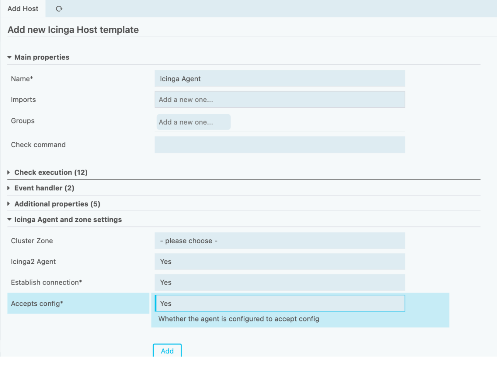
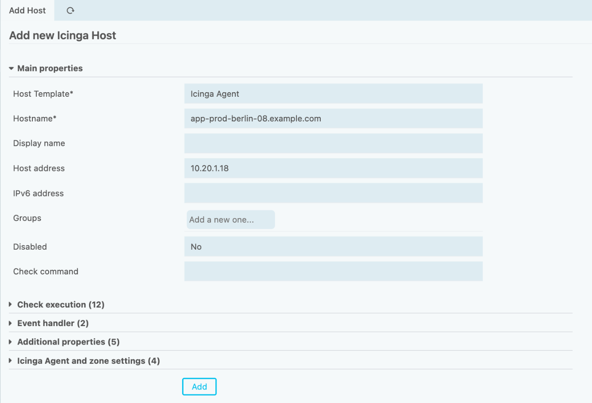
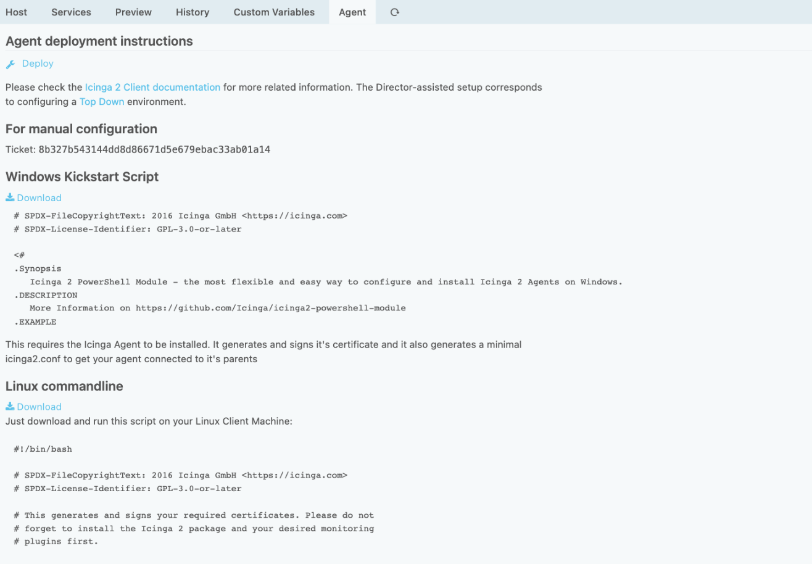
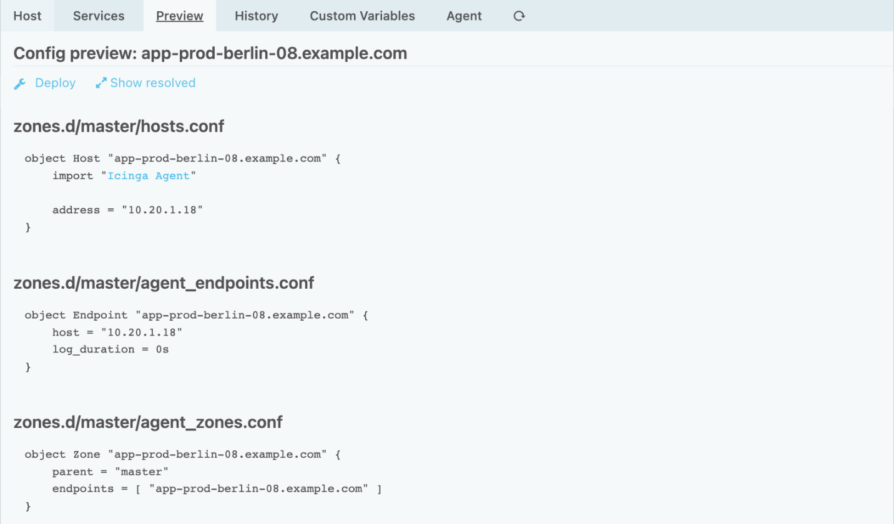
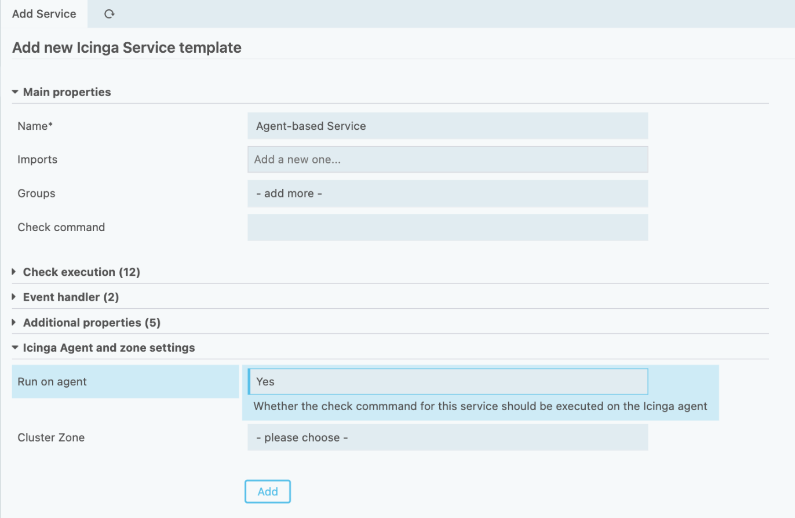
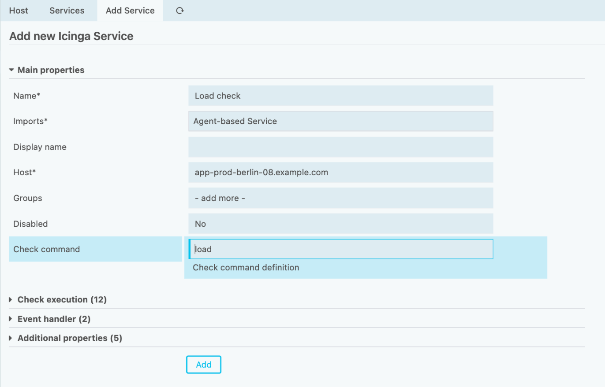
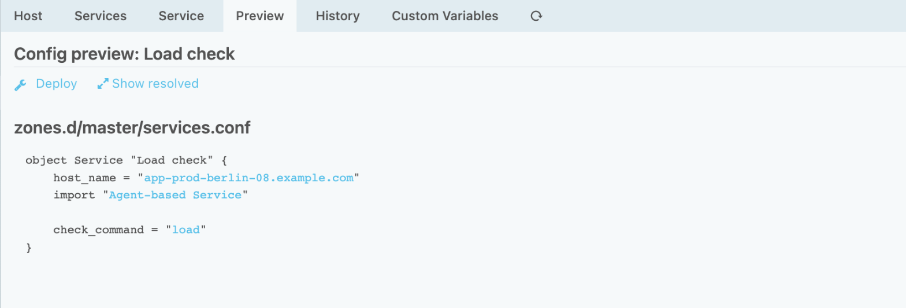
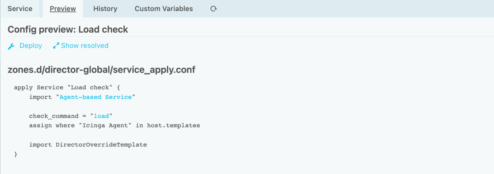
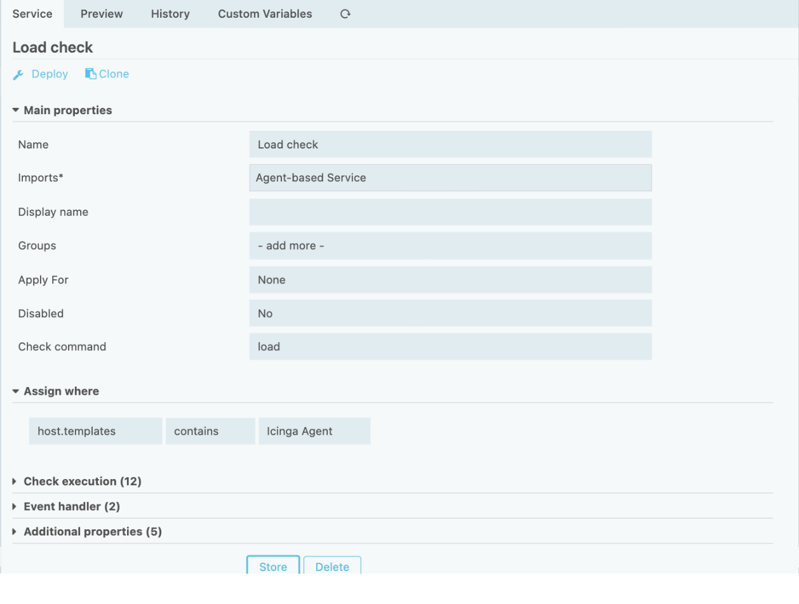

Working with Agents and Config Zones
====================================================================

Working with Icinga 2 Agents can be quite tricky, as each Agent needs
its own Endpoint and Zone definition, correct parent, peering host and
log settings. There may always be reasons for a completely custom-made
configuration. However, I'd **strongly suggest** using the **Director-
assisted** variant. It will save you a lot of headaches.

Preparation
-----------

Agent and zone settings can be set directly on a host object, but for
more than a handful of Agents it's usually easier to create an "Icinga
Agent" template. You could name it exactly like that; it's important
to use meaningful names for your templates.

As long as you're not using Satellite nodes, a single Agent zone is all
you need. Otherwise, assign each Agent to the zone of its Satellite,
either directly on the host or by assigning it a template dedicated to
that Satellite zone. A dedicated template per zone pays off once you're
managing many Agents, as it lets you move all of them into the right
zone at once instead of editing every host individually.

Usage
-----

Well, create a host, choose an Agent template, that's it:

Once you import the "Icinga Agent" template, you'll see a new "Agent" tab.
It hands you a signed ticket for manual configuration, plus a ready-to-run
Windows Kickstart Script and Linux commandline script, both available for
download and previewed right there on the page:

The preview shows that the Icinga Director would deploy multiple objects
for your newly created host:

Create Agent-based services
---------------------------

Similar game for services that should run on your Agents. First, create a
template with a meaningful name. Then, define that Services inheriting from
this template should run on your Agents.

Please do not set a cluster zone, as this would rarely be necessary.
Agent-based services will always be deployed to their Agent's zone by
default. All you need to do now for services that should be executed
on your Agents is importing that template, for example when creating
a service directly on one of your Agent-based hosts:

Config preview shows that everything works as expected:

Instead of creating a Service for every single host, you can also apply
your `Agent-based Service` template to all hosts using the "Icinga Agent"
template at once. Create an Apply Rule for services, import your template
and assign it wherever `"Icinga Agent" in host.templates`:

The Service tab shows how such an Apply Rule is configured, combining the
imported template with your assignment filter:

