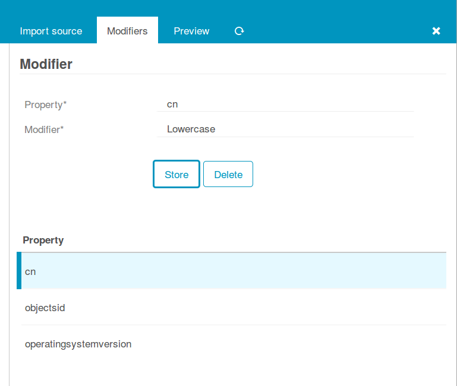
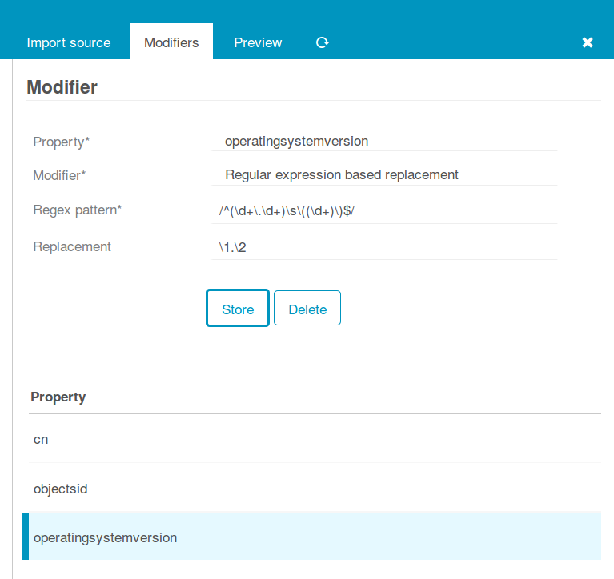
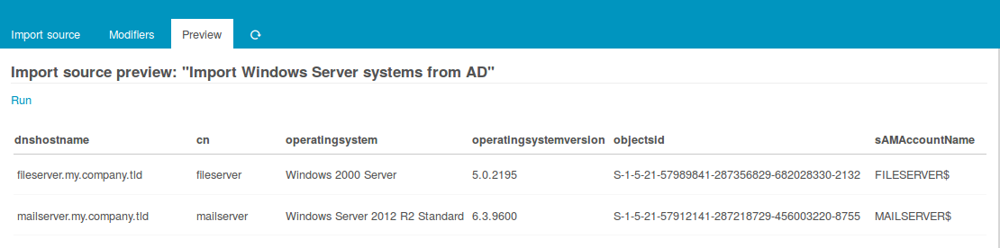
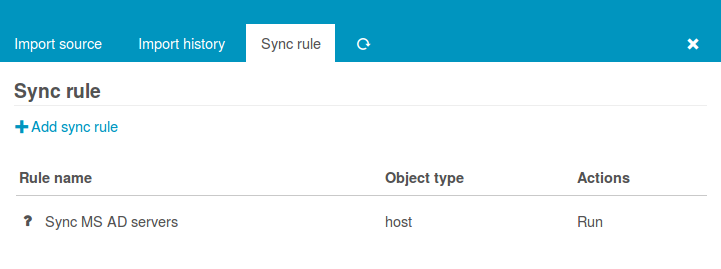
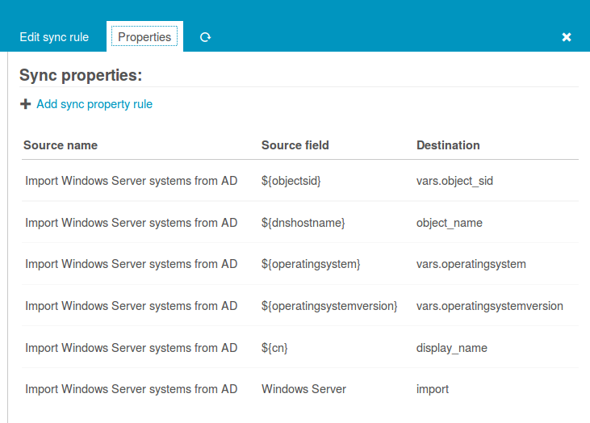
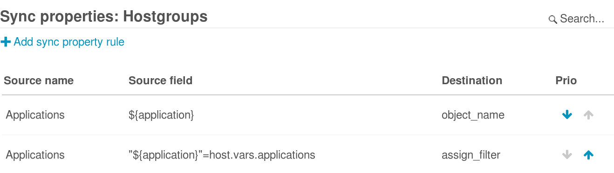
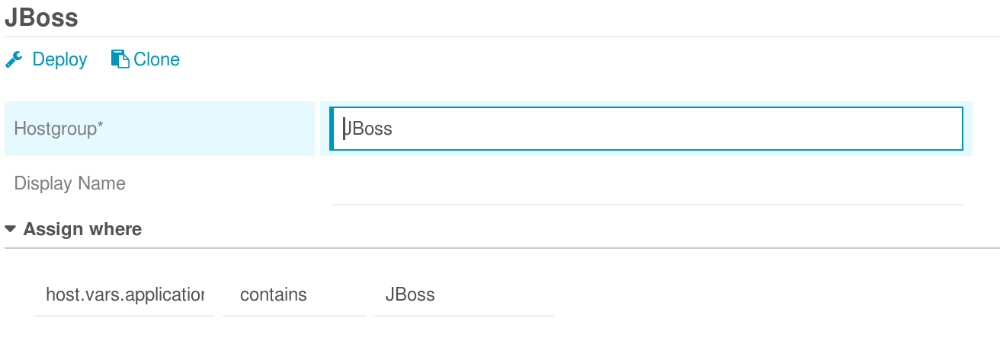

Import and Synchronization
======================================================

Icinga Director offers very powerful mechanisms when it comes to fetching data
from external data sources.

The following examples should give you a quick idea of what you might want to
use this feature for. Please note that Import Data Sources are implemented as
hooks in Director. This means that it is absolutely possible and probably very
easy to create custom data sources for whatever kind of data you have. And you
do not need to modify the Director source code for this, you can ship your very
own importer in your very own Icinga Web 2 module.

Examples
--------

### Import Servers from MS Active Directory

#### Create a new import source

Importing data from LDAP sources is pretty easy. We use MS Active Directory
as an example source:

You must formerly have configured a corresponding LDAP resource in your Icinga Web.
Then you choose your preferred object class, you might add custom filters, a search
base should always be set.

The only tricky part here are the chosen Properties. You must know them and you
are required to fill them in, no way around this right now. Also please choose one
column as your key column.

In case you want to avoid trouble please make this the column that corresponds to
your desired object name for the objects you are going to import. Rows duplicating
this property will be considered erroneous, the Import would fail.

#### Property modifiers

Data sources like SQL databases provide very powerful modifiers themselves. With a
handcrafted query you can solve lots of data conversion problems. Sometimes this is
not possible, and some sources (like LDAP) do not even have such features.

This is where property modifiers jump in to the rescue. Your computer names are
uppercase and you hate this? Use the lowercase modifier:

You want to have the object SID as a custom variable, but the data is stored
binary in your AD? There is a dedicated modifier:

You do not agree with the way Microsoft represents its version numbers? Regular
expressions are able to fix everything:

#### Preview

A quick look at the preview confirms that we reached a good point, that's the data
we want:

#### Synchronization

The Import itself just fetches raw data, it does not yet try to modify any of your
Icinga objects. That's what the Sync rules have been designed for. This distinction
has a lot of advantages when it goes to automatic scheduling for various import and
sync jobs.

When creating a Synchronization rule, you must decide which Icinga objects you want
to work with. You could decide to use the same import source in various rules with
different filters and properties.

For every property you must decide whether and how it should be synchronized. You
can also define custom expressions, combine multiple source fields, set custom
properties based on custom conditions and so on.

Now you are all done and ready to a) launch the Import and b) trigger your synchronization
run.

Hints
--------

### Importing assign filters

The Director uses Icinga Web 2 filters as assign filters which are then rendered to Icinga 2 assign rules.
This is great for graphical use, but requires some special formatting for automatic import. In addition the
value has to be urlencoded which can be done by the corresponding property modifier.

Icinga 2 (assign rule)         | Director (graphical representation) | Director (filter)
-------------------------------|-------------------------------------|-----------------------------
host.vars.os == "Linux"        | host.vars.os = Linux                | host.vars.os=%22Linux%22
host.vars.os != "Linux"        | host.vars.os != Linux               | host.vars.os!=%22Linux%22
match("Linux*",host.vars.os)   | host.vars.os = Linux*               | host.vars.os=%22Linux%2A%22
! match("Linux*",host.vars.os) | host.vars.os != Linux*              | host.vars.os!=%22Linux%2A%22
"Linux" in host.vars.os        | host.vars.os contains Linux         | "Linux"=host.vars.os
host.vars.os in [ "Linux" ]    | host.vars.os in Linux               | host.vars.os=%5B%22Linux%22%5D
host.vars.os                   | host.vars.os is true (or set)       | host.vars.os=true
 
The following example creates a host group for every application and assigns hosts which contain the application
in an array for host.vars.applications.

This results in groups like this one for JBoss.

