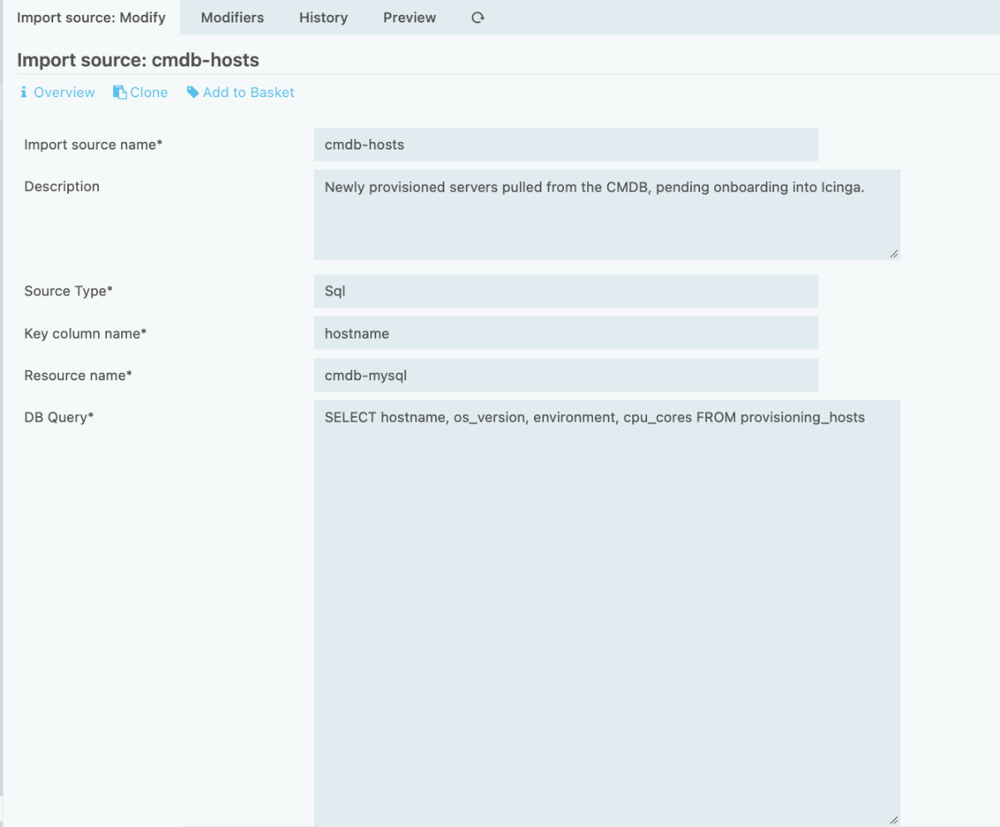
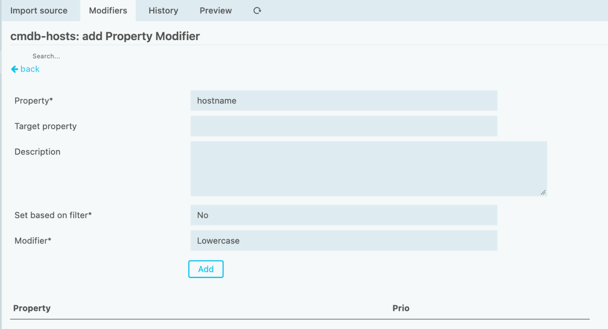
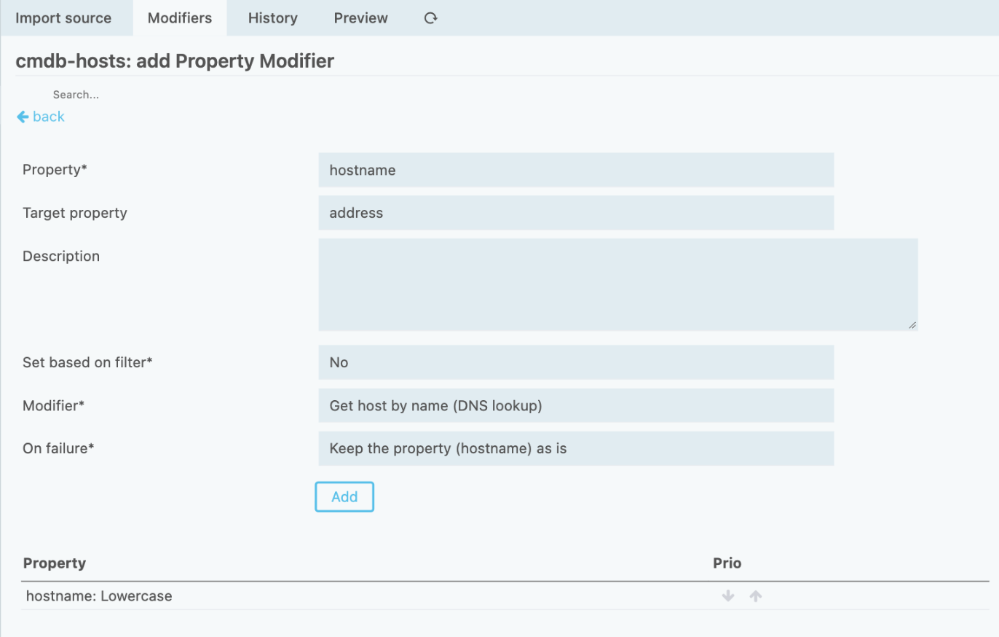
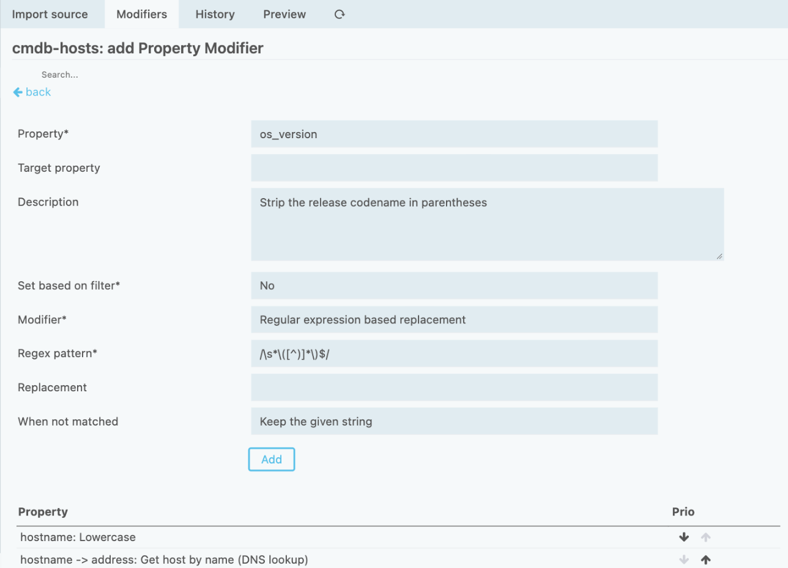
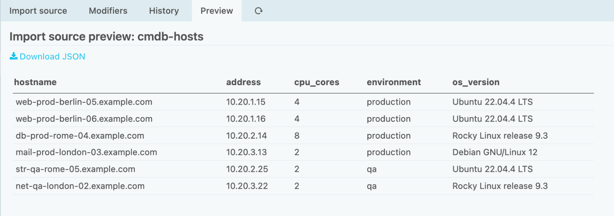
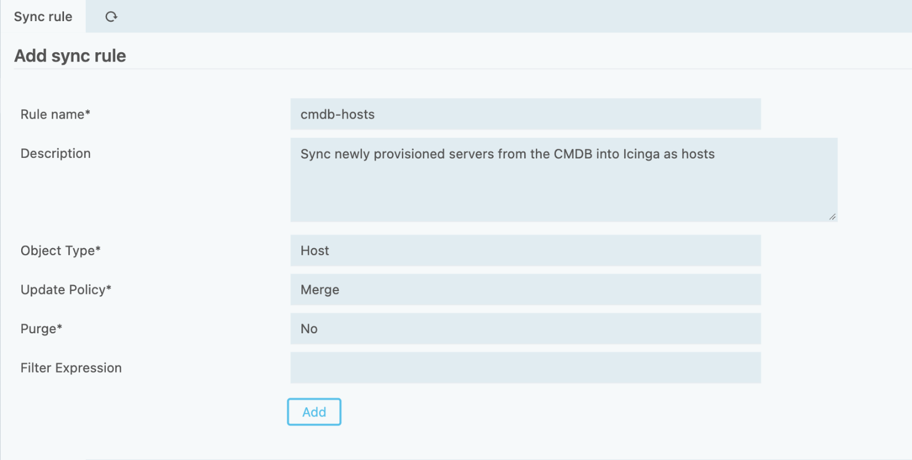
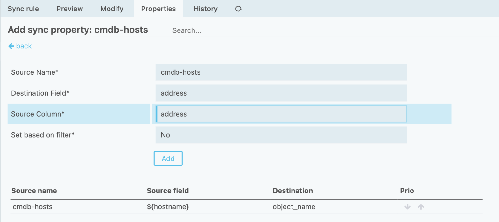
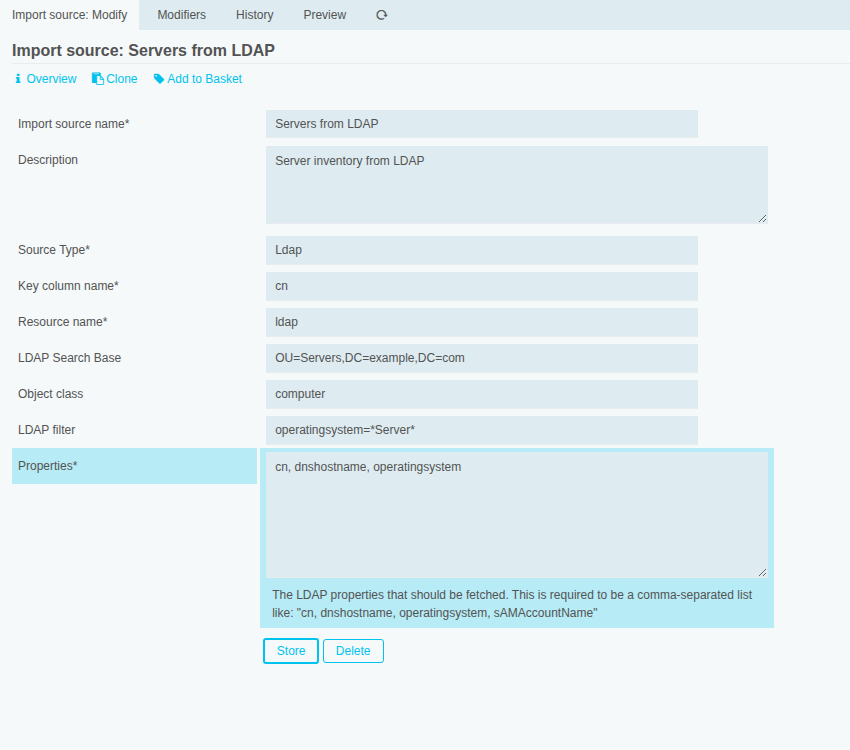
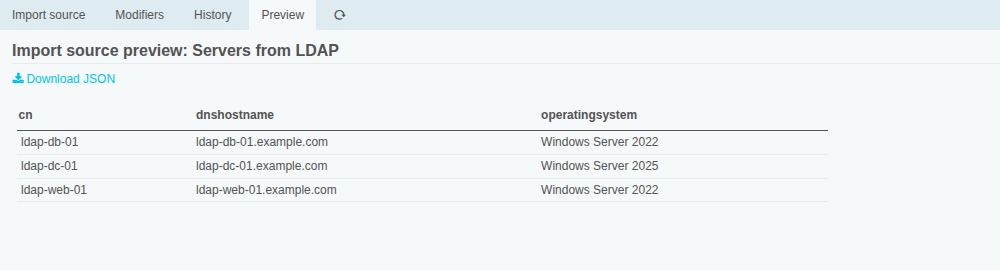

Import and Synchronization
======================================================

Icinga Director offers very powerful mechanisms when it comes to fetching data
from external data sources.

The following examples should give you a quick idea of what you might want to
use this feature for. Please note that Import Data Sources are implemented as
hooks in Director. This means that it is absolutely possible and probably very
easy to create custom data sources for whatever kind of data you have. And you
do not need to modify the Director source code for this, you can ship your very
own importer in your very own Icinga Web 2 module.

Examples
--------

### Import Servers from a CMDB

#### Create a new import source

Importing data from a SQL database is pretty easy. We use a CMDB table listing
newly provisioned servers as an example source:

You must formerly have configured a corresponding database resource in your
Icinga Web. Then you write the query that selects the columns you care about.

The only tricky part here is the key column. You must choose one property as
your key column, and it should correspond to the desired object name for the
objects you are going to import. Rows duplicating this property will be
considered erroneous, the Import would fail.

#### Property modifiers

SQL databases provide very powerful modifiers themselves. With a handcrafted
query you can already solve lots of data conversion problems. Sometimes this
is not possible, or you would rather keep the query simple and let Director
do the conversion. Some sources (like plain files or LDAP) do not even offer
such features in the first place.

This is where property modifiers jump in to the rescue. Your object names are
uppercase and you hate this? Use the lowercase modifier:

Your source only gives you a hostname and no address? Look it up and store it
in a dedicated property:

Your source dumps a release codename you don't care about right into the
value? Regular expressions are able to fix everything:

#### Preview

A quick look at the preview confirms that we reached a good point, that's the data
we want:

#### Synchronization

The Import itself just fetches raw data, it does not yet try to modify any of your
Icinga objects. That's what the Sync rules have been designed for. This distinction
has a lot of advantages when it goes to automatic scheduling for various import and
sync jobs.

When creating a Synchronization rule, you must decide which Icinga objects you want
to work with. You could decide to use the same import source in various rules with
different filters and properties.

For every property you must decide whether and how it should be synchronized. You
can also define custom expressions, combine multiple source fields, set custom
properties based on custom conditions and so on.

Now you are all done and ready to a) launch the Import and b) trigger your synchronization
run.

### Import Servers from LDAP or Active Directory

Director can import hosts from an LDAP directory, including Microsoft Active
Directory. An import source selects the directory entries and attributes to
fetch. A sync rule maps those attributes to Icinga hosts.

#### Create a new import source

First configure an LDAP resource in Icinga Web with a bind account that can read
the required entries and attributes. Add an import source in Director, select
**Ldap** as the source type, and select that resource.

Set the search base to the branch containing your servers. Choose the object
class and list the attributes to fetch in **Properties**, separated by commas.
For example, use these settings to import Windows servers from Active Directory:

| Setting          | Example value                      |
|------------------|------------------------------------|
| Key column name  | `cn`                               |
| LDAP Search Base | `OU=Servers,DC=example,DC=com`     |
| Object class     | `computer`                         |
| LDAP filter      | `operatingsystem=*Server*`         |
| Properties       | `cn, dnshostname, operatingsystem` |

Replace the search base with your directory's distinguished name. The filter
selects computers whose operating system contains `Server`. Enter this simple
filter without outer parentheses, as Icinga Web adds them. Omit or adjust it
if you also want other computers. For other LDAP directories, use the object
class and attributes defined by their schema.

Choose a key column that is present and unique for every imported row. Here,
`cn` also supplies the Icinga host name. If common names repeat across your
directory, narrow the search base or use a unique attribute such as
`dnshostname`. Include the chosen key column in **Properties**.

#### Property modifiers and preview

LDAP sources do not provide SQL-style expressions for transforming values.
Use Director's property modifiers to prepare the imported data. For example,
add a **Lowercase** modifier for `cn` and leave **Target property** empty to
update the name in place. Make sure the resulting names remain unique.

Active Directory stores `objectSid` as binary data. To use it as a custom
variable, include `objectSid` in the import source's **Properties**, add a
modifier for it, and select **Decode a binary object SID (MSAD)**. Leave
**Target property** empty to replace the binary value with its readable SID.

If needed, use **Regular expression based replacement** to normalize operating
system version strings, or **Get host by name (DNS lookup)** to resolve
`dnshostname` into a separate address property. DNS lookups require the names
to be resolvable from the system running the import.

Open **Preview** to check the selected rows and the results of your modifiers:

#### Synchronize the hosts

Trigger an import run to store the data. Then create a sync rule with object
type **Host**, update policy **Merge**, and **Purge** set to **No**. Add the
following properties, selecting the LDAP import source for each one:

| Destination            | Source                                                            |
|------------------------|-------------------------------------------------------------------|
| `object_name`          | `${cn}`                                                           |
| `address`              | `${dnshostname}`                                                  |
| `vars.operatingsystem` | `${operatingsystem}`                                              |
| `import`               | An existing host template selected under **Inheritance (import)** |

Choose a host template that provides the check command and other settings
required by your hosts. The address mapping uses the DNS name. Use a resolved
address property instead if your checks require an IP address.

For the custom variable, select **Custom variable (vars.)**, enter
`operatingsystem`, and use the **replace** merge policy.

For an Active Directory source with the SID modifier, add a mapping from
`${objectSid}` to `vars.objectSid`. To synchronize other attributes, such as
`operatingsystemversion`, include them in the import source's **Properties**
and add the corresponding sync mappings.

Check the sync rule's **Preview** before running the synchronization. Importing
stores source data, while synchronization creates or updates the Director
objects. Deploy the resulting configuration when it is ready for monitoring.
