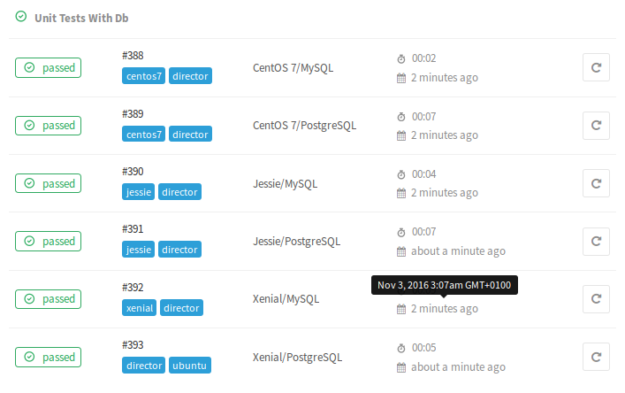
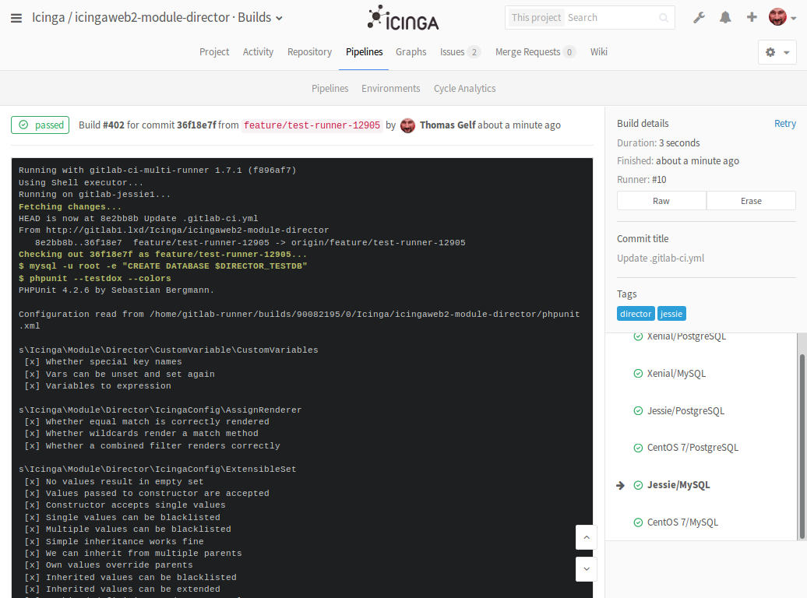
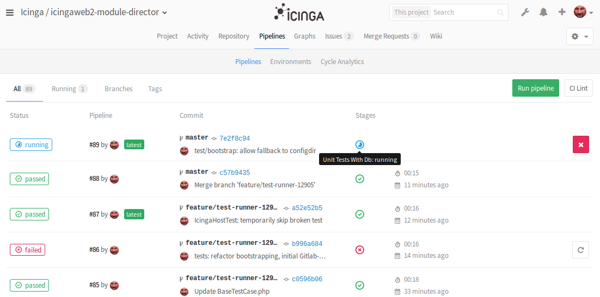

<a id="Testing"></a>Running Unit-Tests for the Director
=======================================================

There are basically multiple ways of running our Unit-Tests. All of them
are explained here.

Let others do the job
---------------------

Well, as there are tests available you might come to the conclusion that
there is probably already someone running them from time to time. So, just
lean back with full trust in our development toolchain and spend your time
elsewhere ;-) Cheers!

### Tests on GitHub

When pushing to [GitHub](https://github.com/Icinga/icingaweb2-module-director/)
or sending pull requests, Unit-Tests are automatically triggered.


### Tests for supported Platforms

As far as we know, Director is currently mostly used on CentOS (or RHEL)
versions 6 and 7, Debian Stable (Jessie) and Ubuntu LTS (Xenial). So we are
running our tests on our own platforms for exactly those systems. All of them
with PostgreSQL, MySQL (or MariaDB).

This way we reach the mostly used Database and PHP versions:




Run tests on demand
-------------------

The easiest variant is to run the tests directly on the system where you
have installed your Director.

### Requirements

* Icinga Web 2 configured
* Director module installed
* A dedicated DB resource
* PHPUnit installed

### Configuration

You can use your existing database resource or create a dedicated one. This
might be either MySQL or PostgreSQL, you just need to tell the Director the
name of your resource:

```ini
; /etc/icingaweb2/modules/director/config.ini

[db]
resource = "Director DB"

[testing]
db_resource = "Director Test DB"
```

### Run your tests

Just move to your Director module path...

    cd /usr/share/icingaweb2/modules/director

...tell Director where to find your configuration...

    export ICINGAWEB_CONFIGDIR=/etc/icingaweb2

...and finally run the tests:

    phpunit

Try parameters like `--testdox` or `--verbose` or check the PHPUnit documentation
to get an output that fits your needs. Depending on your parameters the output
might look like this...

```
PHPUnit 5.1.3 by Sebastian Bergmann and contributors.

.................................................S............... 65 / 81 ( 80%)
..S.............                                                  81 / 81 (100%)

Time: 1.8 seconds, Memory: 10.00Mb

OK, but incomplete, skipped, or risky tests!
Tests: 81, Assertions: 166, Skipped: 2.
```

...or this:

```
PHPUnit 5.1.3 by Sebastian Bergmann and contributors.

s\Icinga\Module\Director\CustomVariable\CustomVariables
 [x] Whether special key names
 [x] Vars can be unset and set again
 [x] Variables to expression

s\Icinga\Module\Director\IcingaConfig\AssignRenderer
 [x] Whether equal match is correctly rendered
 [x] Whether wildcards render a match method
 [x] Whether a combined filter renders correctly

s\Icinga\Module\Director\IcingaConfig\ExtensibleSet
 [x] No values result in empty set
 [x] Values passed to constructor are accepted
 [x] Constructor accepts single values
 [x] Single values can be blacklisted
 [x] Multiple values can be blacklisted
 [x] Simple inheritance works fine
 [x] We can inherit from multiple parents
 [x] Own values override parents
 [x] Inherited values can be blacklisted
 [x] Inherited values can be extended
 [x] Combined definition renders correctly

s\Icinga\Module\Director\IcingaConfig\IcingaConfigHelper
 [x] Whether interval string is correctly parsed
 [x] Whether invalid interval string raises exception
 [x] Whether an empty value gives null
 [x] Whether interval string is correctly rendered
 [x] Correctly identifies reserved words
 ...

```

The very same output could look as follows when shown by your CI-Tool:



Running with Gitlab-CI
----------------------

This chapter assumes that you have Gitlab and Gitlab-CI up and running. Our
`gitlab-ci.yml` file currently supposes you to have shared runners providing
specific tags and the following operating systems, each of them with MySQL and
PostgreSQL installed locally:

* CentOS 7
* Debian Stable (Jessie)
* Ubuntu 16.04 LTS (Xenial)

### Preparing the Gitlab Runners

The following instructions suppose that you provide runner instances with a very
basic installation of each operating system. We used naked LXC instances immediately
after launching them.

For all of them, please define the following variables first:

```sh
# The URL pointing to your Gitlab installation
GITLAB_URL=https://your.gitlab.example.com

# The registration token for your Gitlab runners
REGISTRATION_TOKEN=iwQs************kLbH7
```

#### CentOS 7

```sh
yum makecache
curl -L https://packages.gitlab.com/install/repositories/runner/gitlab-ci-multi-runner/script.rpm.sh | bash

# Sad workaround for container/chroot issues
sed -i'' 's/repo_gpgcheck=1/repo_gpgcheck=0/' /etc/yum.repos.d/runner_gitlab-ci-multi-runner.repo

# Package installation
yum install -y https://dl.fedoraproject.org/pub/epel/epel-release-latest-7.noarch.rpm
yum install -y https://packages.icinga.com/epel/7/release/noarch/icinga-rpm-release-7-1.el7.centos.noarch.rpm
yum install -y php-Icinga icingaweb2-common phpunit mariadb-server postgresql-server \
  postgresql-contrib gitlab-ci-multi-runner

# Initialize the PostgreSQL data directory
postgresql-setup initdb

# We do not want to use Ident-based auth
sed -ri 's/(all\s+127.0.0.1\/32\s+)ident/\1md5/' /var/lib/pgsql/data/pg_hba.conf

# Start and enable all services
systemctl enable postgresql
systemctl start postgresql
systemctl enable mariadb
systemctl start mariadb

# Fix platform-specific encoding issues
echo "UPDATE pg_database SET datistemplate = FALSE WHERE datname = 'template1'" | su - postgres -c psql
echo "DROP DATABASE template1" | su - postgres -c psql
echo "CREATE DATABASE template1 WITH TEMPLATE = template0 ENCODING = 'UNICODE'" | su - postgres -c psql
echo "UPDATE pg_database SET datistemplate = TRUE WHERE datname = 'template1'" | su - postgres -c psql
echo "VACUUM FREEZE" | su - postgres -c psql template1

# Grant the gitlab-runner ident-based admin access
su - postgres -c 'createuser -a -d gitlab-runner'

# Register the runner with your Gitlab installation
gitlab-ci-multi-runner register -n \
  -r "$REGISTRATION_TOKEN" \
  --executor shell \
  -u "$GITLAB_URL" \
  --tag-list centos7,director
```

#### CentOS 6

```
yum makecache
curl -L https://packages.gitlab.com/install/repositories/runner/gitlab-ci-multi-runner/script.rpm.sh | bash

# Package installation
yum install -y https://dl.fedoraproject.org/pub/epel/epel-release-latest-6.noarch.rpm
yum install -y https://packages.icinga.com/epel/6/release/noarch/icinga-rpm-release-6-1.el6.noarch.rpm
yum install -y php-Icinga icingaweb2-common phpunit mysql-server gitlab-ci-multi-runner

# Start and enable MySQL
/etc/init.d/mysqld start
chkconfig mysqld on

# No PostgeSQL, 8.4 on CentOS 6 is too old

# Register the runner with your Gitlab installation
gitlab-ci-multi-runner register -n \
  -r "$REGISTRATION_TOKEN" \
  --executor shell \
  -u "$GITLAB_URL" \
  --tag-list centos6,director
```

#### Debian Stable (Jessie)

```sh
# Package installation
apt-get update -q -q
apt-get install -y -q wget curl
wget -q -O - http://packages.icinga.com/icinga.key | apt-key add -
echo 'deb http://packages.icinga.com/debian icinga-jessie main' > /etc/apt/sources.list.d/icinga.list
curl -L https://packages.gitlab.com/install/repositories/runner/gitlab-ci-multi-runner/script.deb.sh | bash
apt-get update -q -q
DEBIAN_FRONTEND=noninteractive apt-get install --no-install-recommends -q -y \
  php5-cli phpunit php5-mysql php5-json php5-fpm zend-framework php-icinga php5-pgsql \
  mysql-server postgresql postgresql-client postgresql-contrib-9.4 \
  gitlab-ci-multi-runner

# Grant the gitlab-runner ident-based admin access
su - postgres -c 'createuser -a -d gitlab-runner'

# Register the runner with your Gitlab installation
gitlab-ci-multi-runner register -n \
  -r "$REGISTRATION_TOKEN" \
  --executor shell \
  -u "$GITLAB_URL" \
  --tag-list debian,jessie,director
```

#### Ubuntu 16.04 LTS (Xenial)

```sh
# Package installation
apt-get update -q -q
apt-get install -y -q wget curl
wget -q -O - http://packages.icinga.com/icinga.key | apt-key add -
echo 'deb http://packages.icinga.com/ubuntu icinga-xenial main' > /etc/apt/sources.list.d/icinga.list
curl -L https://packages.gitlab.com/install/repositories/runner/gitlab-ci-multi-runner/script.deb.sh | bash
apt-get update -q -q
DEBIAN_FRONTEND=noninteractive apt-get install --no-install-recommends -q -y \
  php7.0-cli php7.0-mysql php7.0-pgsql php7.0-json php7.0-fpm phpunit zend-framework php-icinga \
  mariadb-server mariadb-client postgresql postgresql-client postgresql-contrib-9.5 \
  gitlab-ci-multi-runner

# Zend Framework is not in our include_path
ln -sf /usr/share/php/libzend-framework-php/Zend /usr/share/php/

# Allow non-root users to use password-less root
mysql -e "UPDATE mysql.user SET plugin = 'mysql_native_password' WHERE User='root'; FLUSH PRIVILEGES;"

# Grant the gitlab-runner ident-based admin access
su - postgres -c 'createuser -a -d gitlab-runner'

# Register the runner with your Gitlab installation
gitlab-ci-multi-runner register -n \
  -r "$REGISTRATION_TOKEN" \
  --executor shell \
  -u "$GITLAB_URL" \
  --tag-list ubuntu,xenial,director
```

A lot of work, sure. But it gives us a lot of confidence when shipping our
software for various platforms.



### Docker, Docker, Docker...

Yes, yes, yes. In future we might eventually provide a similar solution based on
Docker images. Working with throw-away containers seems to be overkill here, as
tearing up those containers would waste much more resources than running the tests.
