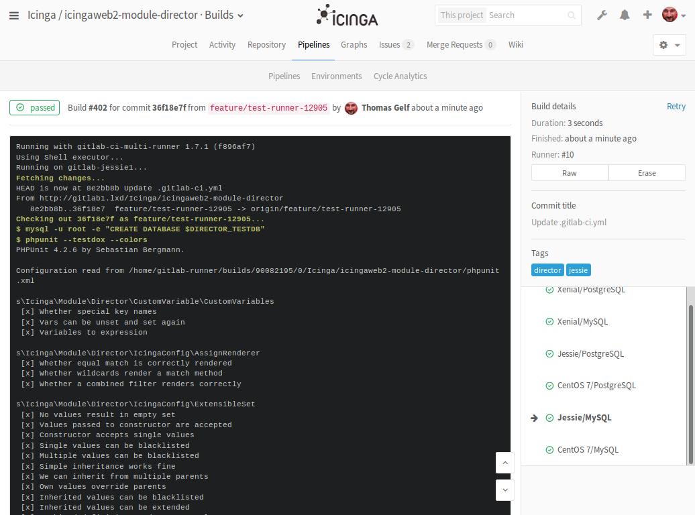

<a id="Testing"></a>Running Unit-Tests for the Director
=======================================================

There are basically multiple ways of running our Unit-Tests. All of them
are explained here.

Let others do the job
---------------------

Well, as there are tests available you might come to the conclusion that
there is probably already someone running them from time to time. So, just
lean back with full trust in our development toolchain and spend your time
elsewhere ;-) Cheers!

### Tests on GitHub

When pushing to [GitHub](https://github.com/Icinga/icingaweb2-module-director/)
or sending pull requests, Unit-Tests are automatically triggered.


The [GitHub Actions workflow](../.github/workflows/php.yml) defines the PHP
versions and database services used for testing.

Run tests on demand
-------------------

The easiest variant is to run the tests directly on the system where you
have installed your Director.

### Requirements

* Icinga Web 2 configured
* Director module installed
* A dedicated DB resource
* PHPUnit installed

### Configuration

You can use your existing database resource or create a dedicated one. This
might be either MySQL or PostgreSQL, you just need to tell the Director the
name of your resource:

```ini
; /etc/icingaweb2/modules/director/config.ini

[db]
resource = "Director DB"

[testing]
db_resource = "Director Test DB"
```

### Run your tests

Just move to your Director module path...

    cd /usr/share/icingaweb2/modules/director

...tell Director where to find your configuration...

    export ICINGAWEB_CONFIGDIR=/etc/icingaweb2

...and finally run the tests:

    phpunit --bootstrap /path/to/icingaweb/test/php/bootstrap.php

Replace `/path/to/icingaweb` with the path to your Icinga Web source tree.
The bootstrap is required to load Icinga Web and register the module's test
namespace.

Try parameters like `--testdox` or `--verbose` or check the PHPUnit documentation
to get an output that fits your needs. Depending on your parameters the output
might look like this...

```
PHPUnit 5.1.3 by Sebastian Bergmann and contributors.

.................................................S............... 65 / 81 ( 80%)
..S.............                                                  81 / 81 (100%)

Time: 1.8 seconds, Memory: 10.00Mb

OK, but incomplete, skipped, or risky tests!
Tests: 81, Assertions: 166, Skipped: 2.
```

...or this:

```
PHPUnit 5.1.3 by Sebastian Bergmann and contributors.

s\Icinga\Module\Director\CustomVariable\CustomVariables
 [x] Whether special key names
 [x] Vars can be unset and set again
 [x] Variables to expression

s\Icinga\Module\Director\IcingaConfig\AssignRenderer
 [x] Whether equal match is correctly rendered
 [x] Whether wildcards render a match method
 [x] Whether a combined filter renders correctly

s\Icinga\Module\Director\IcingaConfig\ExtensibleSet
 [x] No values result in empty set
 [x] Values passed to constructor are accepted
 [x] Constructor accepts single values
 [x] Single values can be blacklisted
 [x] Multiple values can be blacklisted
 [x] Simple inheritance works fine
 [x] We can inherit from multiple parents
 [x] Own values override parents
 [x] Inherited values can be blacklisted
 [x] Inherited values can be extended
 [x] Combined definition renders correctly

s\Icinga\Module\Director\IcingaConfig\IcingaConfigHelper
 [x] Whether interval string is correctly parsed
 [x] Whether invalid interval string raises exception
 [x] Whether an empty value gives null
 [x] Whether interval string is correctly rendered
 [x] Correctly identifies reserved words
 ...

```

The very same output could look as follows when shown by your CI-Tool:


