## Introduction

Custom variables are an integral part in Icinga 2 to control how the monitoring is performed on an object. There are different types of custom variables.
1. String
2. Number
3. Boolean
4. Array
5. Dictionary

Currently, Icinga Director supports all these types and also allows categorization of these variables based of data categories and pre-configuring a list of values as data list and using them in arrays or string. And much more.
However there is a limited support to dictionaries.

Moreover the apply-for rules can only be configured for arrays and not the dictionaries. 

The new implementation for custom properties with the dictionary support in Icinga Director includes the following:

- A new menu section called `Properties` under Icinga Director to configure the properties for objects instead of configuring them as data fields.
- The supported property types are string, number, boolean, fixed-array, dynamic-array, fixed-dictionary and dynamic-dictionary.
- As already mentioned above array and dictionary property types are either:
    1. **Fixed**: You could only assign values to the preconfigured items
    2. **Dynamic**: Here the items are added by users in the monitored objects directly. In case of dictionaries, each added item follows the {key => value} structure. And the value is a dictionary with a preconfigured items.

- The custom property list also shows whether they are being used in a template or not.

- Features not yet included: Inclusion of data list and data categories

- Only one level of nesting is allowed: a dictionary can contain other dictionaries, but those inner dictionaries can contain only non-dictionary values.
- The new custom property support works only for Hosts currently
- The Apply-for rules can now be configured for these dictionaries and on that note they could be configured only for dynamic arrays and dynamic dictionaries.
- `config` is changed to `value` in apply-for rule.

- A new endpoint to update custom variables of a Host using Rest API called `variables` is now available. 
- Configuration baskets also supports new custom property implementation, but only for host templates. Creating a configuration basket and then creating snapshot for the adds also the custom properties used in the corresponding host templates to the snapshot. 
- The automation is not largely affected right now. Since the data lists feature is currently not available in the new custom property feature, the imported data lists cannot be used in the new custom properties.
- The strategy for the migration has not been finalized yet and is under discussion. However, the data fields of type 'string', 'number' and 'bool' which have no data category, should be somehow migrated to custom properties, either by providing an REST API end point to create them once exported or need other methods.
- For later, consider implementing conflict check for custom properties on basket snapshot restore.

## Example Custom Properties Configuration
- First, checkout to the 'dictionary-support' branch of director and apply the schema migration.
- To configure the new custom properties, navigate to Icinga Director->Properties as shown below:
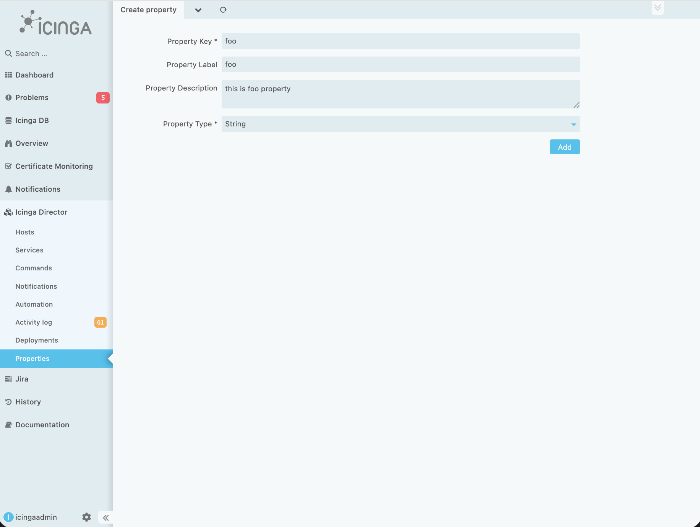
- Click on 'Create property' to add properties
- Below is an example of 'core_disk' dynamic dictionary. Once the dictionary is added, add the fields that each 'core_disk' might contain, by clicking on 'Add Field'.
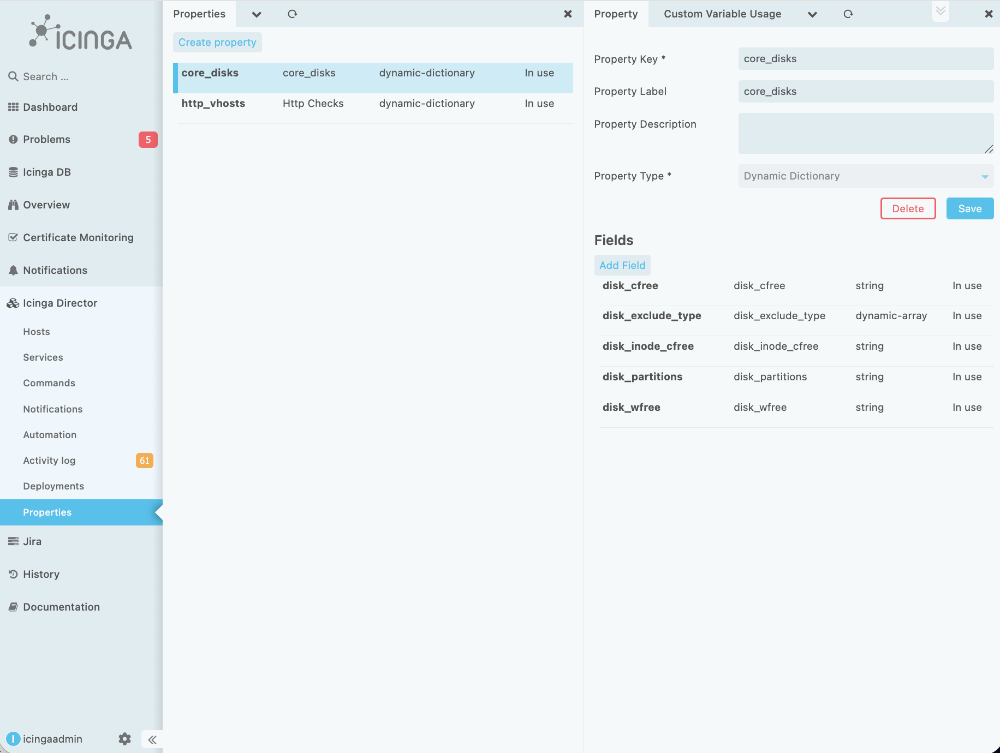
- I have added one more field 'contact_group' as dynamic array, which will be an array of strings.
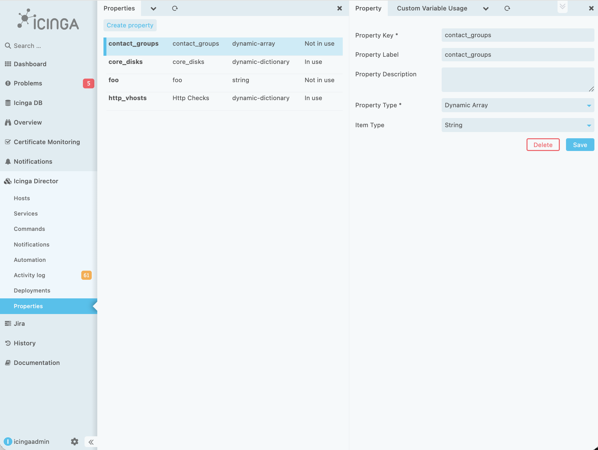

## Adding Custom Properties to Host

- To add the custom properties to host, they must be added to the host template after it is configured.
- There is a separate 'Custom Variables' where the custom properties could be added and configured for the host. As shown in the screenshot below.
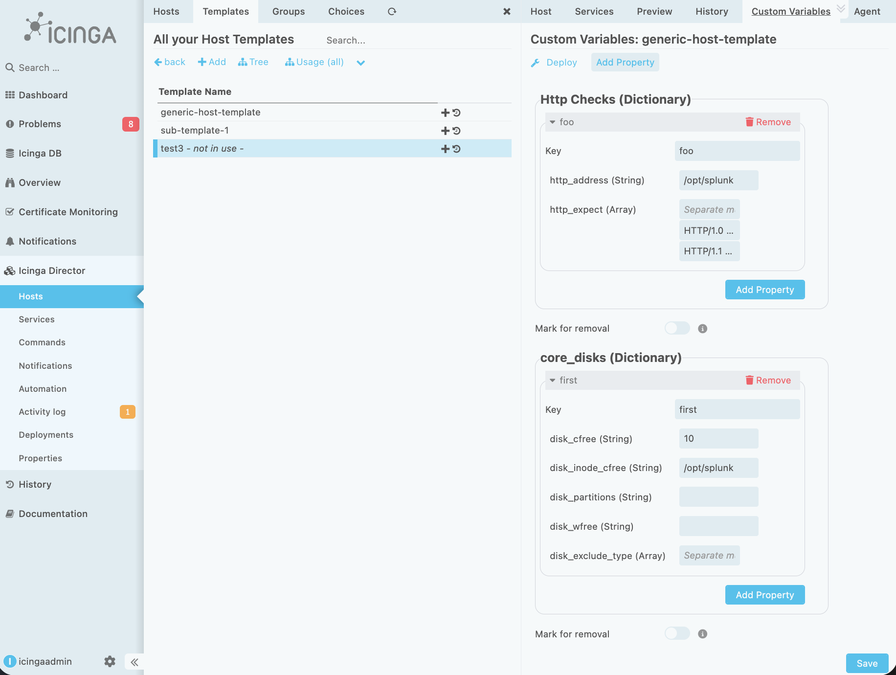
- Click on 'Add Property' button and add the custom properties for the given host. I have added 'core_disks' and 'Http checks' custom variables for this 'generic-host-template'.
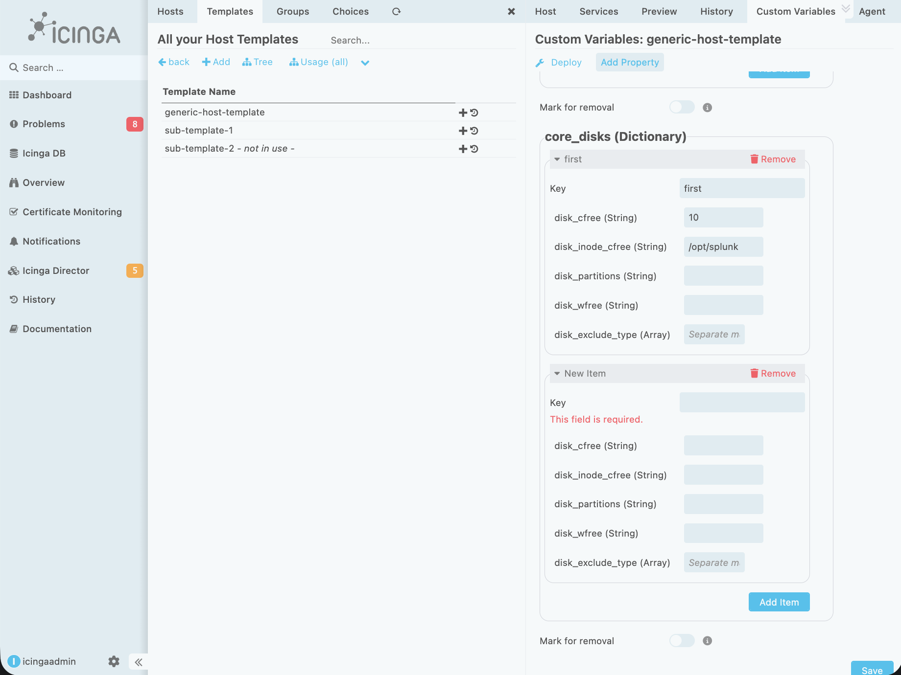
- Once this template or any of its child templates is used in host, the corresponding custom variables or inherited and are available for configuration as shown in screenshots below.

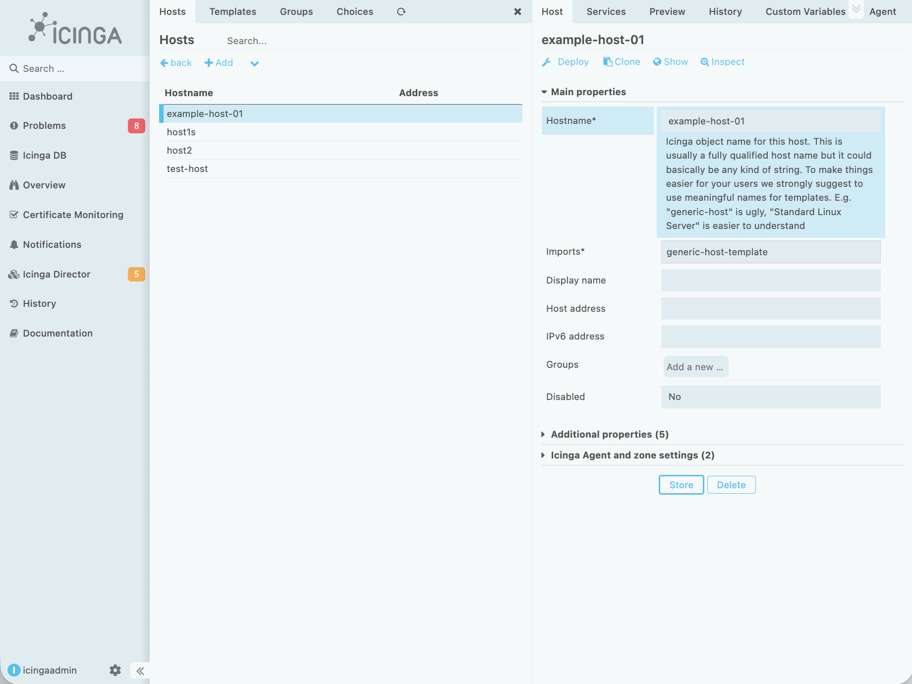
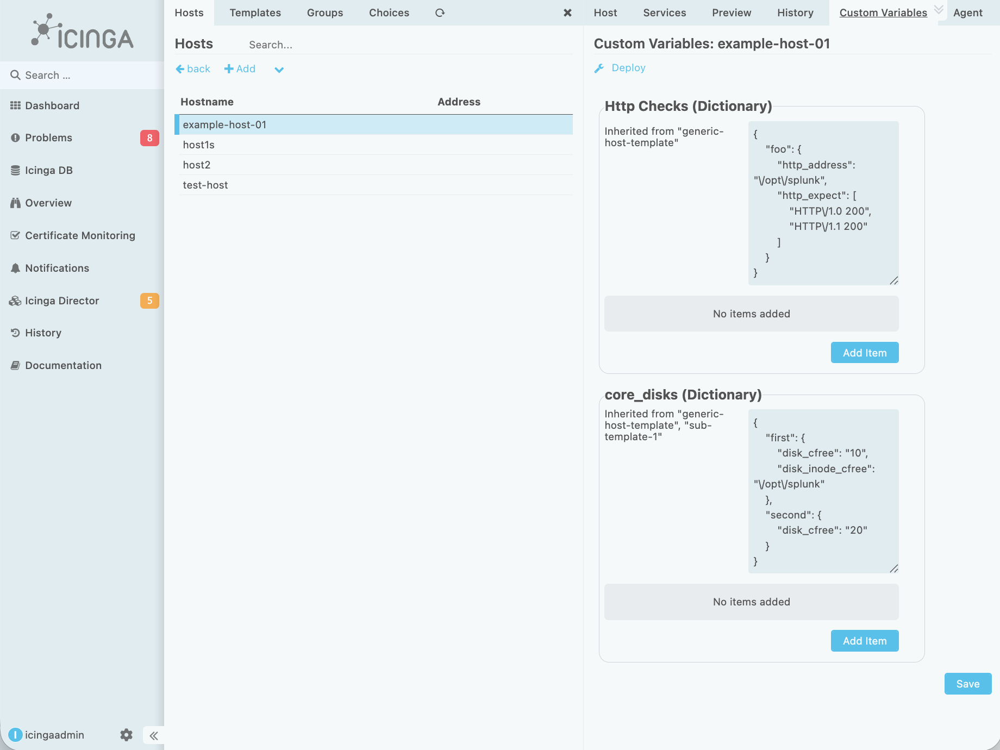


## Updating the Custom Properties of a Host using Rest API

- To update the custom properties of the host 'server-1' using Rest API, execute the below curl command.

<div style="colour: white; background: black">

```
curl -k -u 'icingaadmin:icinga' -H 'Accept: application/json' -H 'Content-Type: application/json' -X PUT 'http://localhost/icingaweb2/director/host/variables?name=server-1' -d '{
   "disk_check": {
       "disk1": {
           "auth": {
                "Pass": "pass",
                "user": "admin"
            },
            "critical": "20",
            "warning": "15"
        },
        "disk2": {
           "auth": {
                "Pass": "test",
                "user": "test"
            },
            "critical": "20",
            "warning": "10"
        }
    },
    "contact_groups": [ "test", "admin" ]
}'
```
</div>

## Apply-for Rules for the disk_check dictionary

- Configure 'generic-service' template.
- The data fields for service are configured as it was usually being done. Here, I have configured all the necessary custom variables as string type data fields and added them to the 'generic-service' template. The reason I have configured the data fields as string type is because all these custom variables will inherit the properties from the host disk_check custom variable, which will be shown in the following steps.

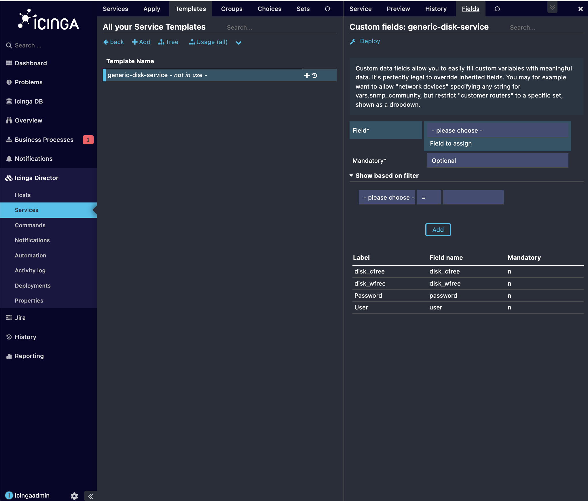

- Now configure the apply rule for the host disk_check custom variable as shown below. As shown in the screenshots below the items from the host.var.disk_check as accessed through $value.<item>$ (This is shown in the hint below the Custom properties section). And hence the data fields were configured as string type.

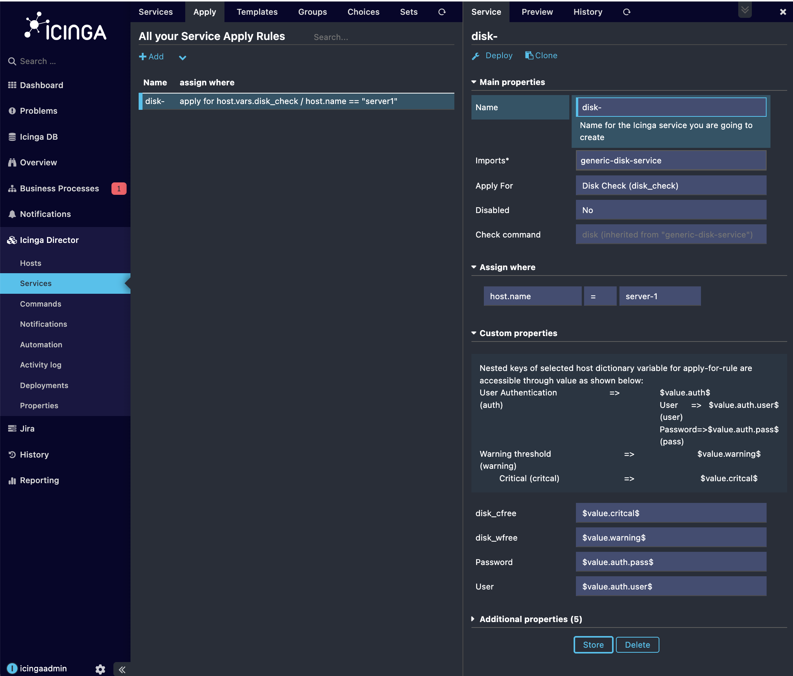
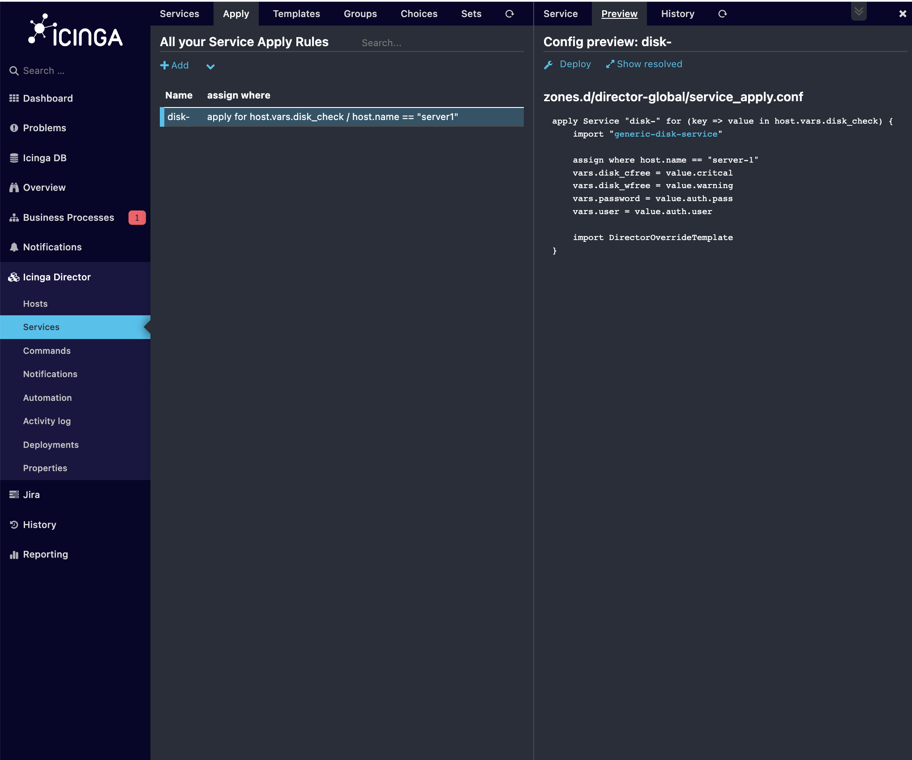

-After they are configured, deploy them. The deployed host and services are shown in the screenshot below.


<!-- // Use cases needs to be documented and the reasons for the given types.

-> Fixed array
-> Fixed Dictionary
-> Dynamic Dictionary
-> String
-> Number
-> Boolean -->

## Use Cases for the fixed dictionary, dynamic dictionary and fixed array

### Fixed Dictionary

A dictionary in according to the [Icinga 2 Docs](https://icinga.com/docs/icinga-2/latest/doc/17-language-reference/#array) is an unordered list of key-value pairs. Hence the custom variables of this type is stored as key-value pair. Below are the few use cases.

1. Configuring database connection parameters:
```
  vars.mysql = {
    user = "dev"
    password = "password123"
    database = "dev"
  }
```

The below screenshot shows the configuration for the custom property `mysql`, if its type is fixed-dictionary. 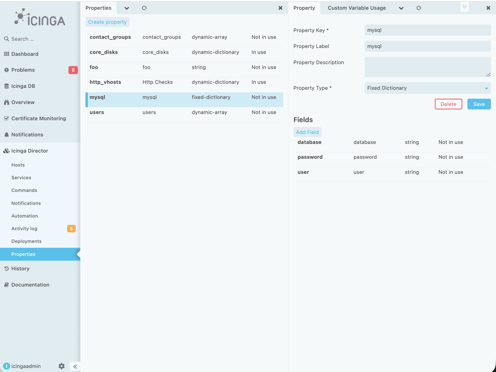

2. Configuring contacts in contact groups
```
  vars.contacts = {
    admins = [ "alice", "bob" ]
    ops = [ "carol" ]
  }
```

### Dynamic Dictionary

The value here is always a dictionary, whose structure is preconfigured. Below are some use cases:
1. Configuring ssh arguments for the ssh check used to check disk free space
Example:
```
    vars.by_ssh_arguments = {
        "-c" = {
            description = "Critical threshold"
            value = "5%"
        },
        "-w" = {
            description = "Warning threshold"
            value = "15%"
        }
    }
```
2. Configuring virtual hosts for http check
```
    vars.http_vhosts += {
        bar = {
            direct_notify = false
            http_address = "foo-bar.com"
        }
        test = {
            direct_notify = true
            http_address = "example.com"
            http_expect = [ "HTTP/1.0 200", "HTTP/1.1 200" ]
            http_port = "443"
            http_uri = "/api"
        }
    }
```

The dynamic dictionary is assigned differently compared to other custom properties.

For the other type the custom properties are defined in the template and the values are overwritten in the hosts or templates importing the base template.

In case of dynamic dictionary, the values are not overwritten instead they are appended.

The values of the custom variable of dynamic-dictionary type are merged when a host or template imports multiple templates that share a common base template where the variable was originally defined. If those imported templates also add new items to that variable, all the additions from each level are combined on the host. See the mermaid diagram below depicting the same.

For example:

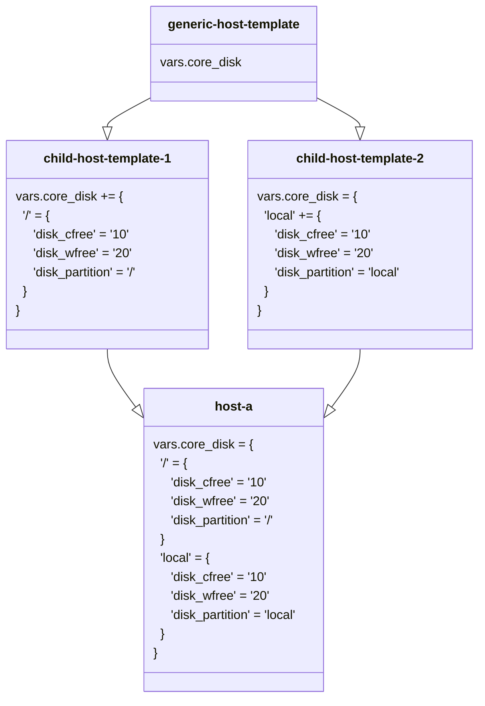
```mermaid
  classDiagram
    generic-host-template --|> child-host-template-1
    generic-host-template --|> child-host-template-2
    child-host-template-1 --|> host-a
    child-host-template-2 --|> host-a
    generic-host-template: vars.core_disk
    class child-host-template-1 {
              vars.core_disk += #123;
              &nbsp&nbsp'/' = #123;
                &nbsp&nbsp&nbsp&nbsp 'disk_cfree' = '10'
                &nbsp&nbsp&nbsp&nbsp 'disk_wfree' = '20' 
                &nbsp&nbsp&nbsp&nbsp 'disk_partition' = '/' 
              &nbsp&nbsp#125;
            #125;
    }
    class child-host-template-2 {
              vars.core_disk = #123;
              &nbsp&nbsp'local' += #123;
                &nbsp&nbsp&nbsp&nbsp 'disk_cfree' = '10'
                &nbsp&nbsp&nbsp&nbsp 'disk_wfree' = '20' 
                &nbsp&nbsp&nbsp&nbsp 'disk_partition' = 'local' 
              &nbsp&nbsp#125;
            #125;     
    }
    class host-a{
        vars.core_disk = #123;
              &nbsp&nbsp'/' = #123;
                &nbsp&nbsp&nbsp&nbsp 'disk_cfree' = '10'
                &nbsp&nbsp&nbsp&nbsp 'disk_wfree' = '20' 
                &nbsp&nbsp&nbsp&nbsp 'disk_partition' = '/' 
              &nbsp&nbsp#125;
              &nbsp&nbsp'local' = #123;
                &nbsp&nbsp&nbsp&nbsp 'disk_cfree' = '10'
                &nbsp&nbsp&nbsp&nbsp 'disk_wfree' = '20' 
                &nbsp&nbsp&nbsp&nbsp 'disk_partition' = 'local' 
              &nbsp&nbsp#125;
        #125;
    }
```

### Fixed Array

An array in according to the [Icinga 2 Docs](https://icinga.com/docs/icinga-2/latest/doc/17-language-reference/#array) is an ordered list of values. Hence the custom variables of this type store only values, not keys. However, a predefined structure can be used to assign meaning to each value in the array. This type of custom variable has similar use case to fixed dictionary, but the custom variable will be saved as array instead without the keys.

Example:

```
  vars.mysql = ["dev", "password123", "dev"]
```

The below screenshot shows the configuration for the custom property `mysql`, if its type is fixed-array. 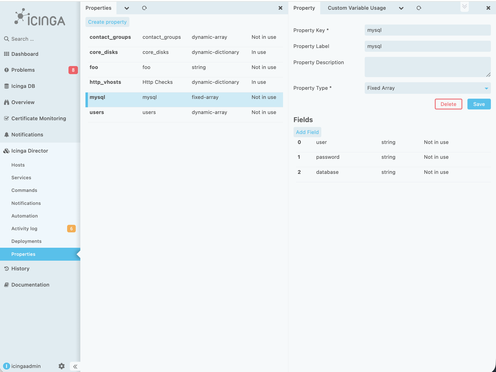


### Dynamic Array

Here, you could added many values of the same type to the array. In other words it must be an uniform array.

Example:

```
  vars.contact_groups = ["admin", "prod", "dev"]
```

The below screenshot shows the configuration for the custom property `contact_groups`.


## Example of Configuration Basket

The below screenshot show an example of the configuration basket snapshot for host templates.

**Configuration Basket:**
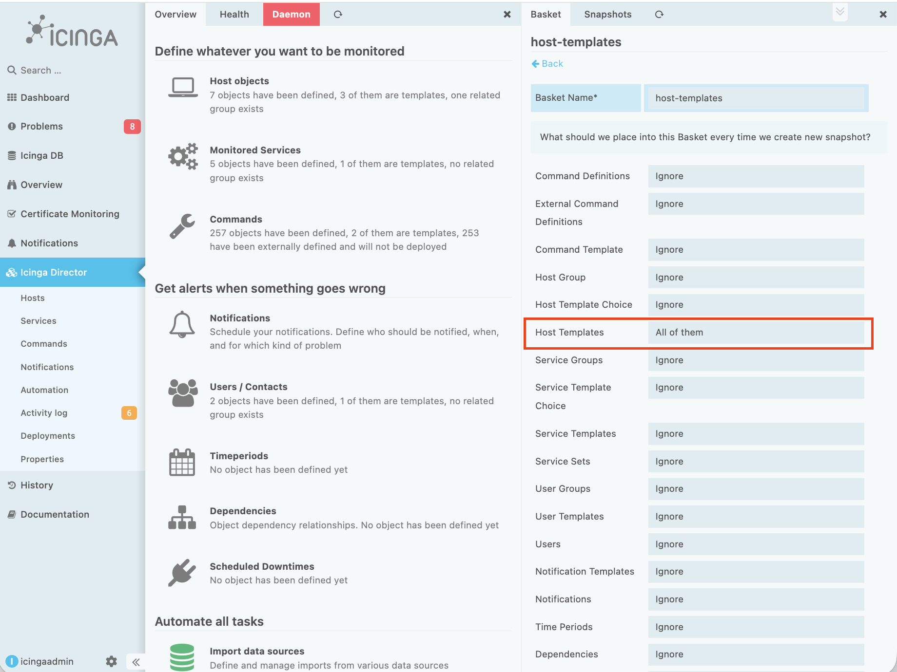

**Basket Snapshot:**
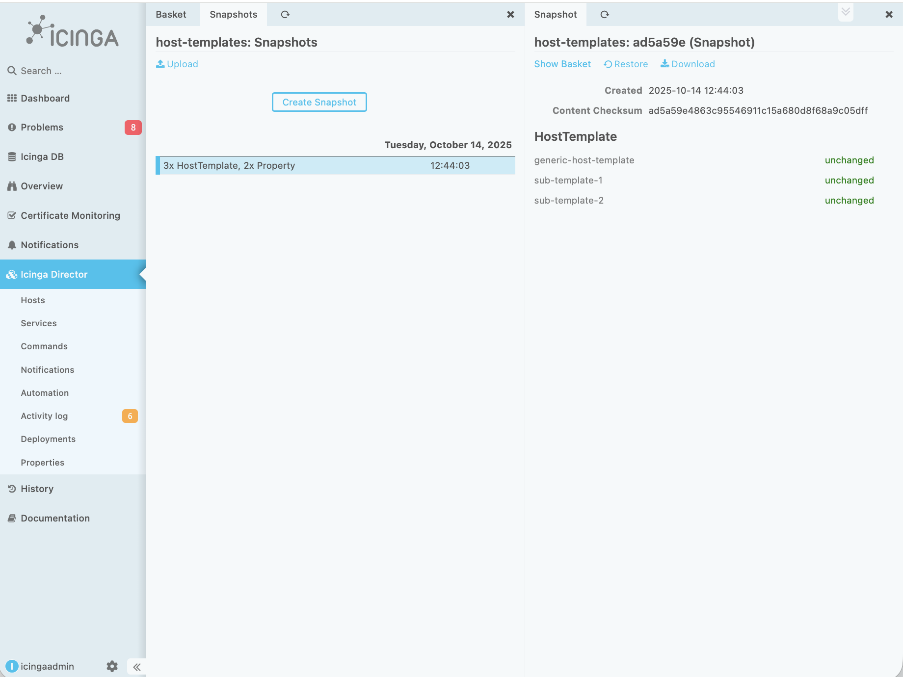

**Basket Snapshot Content:**
<pre style="white-space: pre-wrap; word-break: break-word; background: #f8f8f8; padding: 10px; border: 1px solid #ddd;"><code class="language-json">
"HostTemplate": {
    "generic-host-template": {
      "check_command": "random fortune",
      "max_check_attempts": "25",
      "object_name": "generic-host-template",
      "object_type": "template",
    <div style="border: 2px solid red; width:fit-content;">
      "properties": [
        {
          "property_uuid": "65504893-934e-4af0-aabe-f87b18e53d89"
        },
        {
          "property_uuid": "f729a7f4-ba34-400f-bb41-b27d0dd4cdcf"
        }
      ],
    </div>
      "uuid": "93cda885-1738-438a-8c9e-13aec1de7e4b",
      "vars": {
        "core_disks": {
          "first": {
            "disk_cfree": "10",
            "disk_inode_cfree": "/opt/splunk"
          }
        },
        "http_vhosts": {
          "foo": {
            "http_address": "/opt/splunk",
            "http_expect": [
              "HTTP/1.0 200",
              "HTTP/1.1 200"
            ]
          }
        }
      }
    },
    "sub-template-1": {
      "check_command": "random fortune",
      "imports": [
        "generic-host-template"
      ],
      "object_name": "sub-template-1",
      "object_type": "template",
      "properties": [],
      "uuid": "d798c43a-6b0f-4504-bbc7-a0785b9e1792",
      "vars": {
        "core_disks": {
          "second": {
            "disk_cfree": "20"
          }
        }
      }
    },
    "sub-template-2": {
      "object_name": "sub-template-2",
      "object_type": "template",
      "properties": [],
      "uuid": "db357026-4360-44e9-bcf0-4405b9f68a2c",
      "vars": {
        "core_disks": {
          "third": {
            "disk_cfree": "30"
          }
        }
      }
    }
  },
<div style="border: 2px solid red; width:fit-content;">
"Property": {
    "65504893-934e-4af0-aabe-f87b18e53d89": {
      "uuid": "65504893-934e-4af0-aabe-f87b18e53d89",
      "key_name": "core_disks",
      "parent_uuid": null,
      "value_type": "dynamic-dictionary",
      "label": "core_disks",
      "description": null,
      "items": {
        "disk_cfree": {
          "uuid": "6a865d74-edfa-4039-b89e-b93834b8aa1e",
          "key_name": "disk_cfree",
          "parent_uuid": "65504893-934e-4af0-aabe-f87b18e53d89",
          "value_type": "string",
          "label": "disk_cfree",
          "description": null,
          "items": []
        },
        "disk_exclude_type": {
          "uuid": "9adb3cca-f233-4409-be77-21716bcc4da7",
          "key_name": "disk_exclude_type",
          "parent_uuid": "65504893-934e-4af0-aabe-f87b18e53d89",
          "value_type": "dynamic-array",
          "label": "disk_exclude_type",
          "description": null,
          "items": [
            {
              "uuid": "8d242573-8349-4458-95b7-0d7c4f5bd475",
              "key_name": "0",
              "parent_uuid": "9adb3cca-f233-4409-be77-21716bcc4da7",
              "value_type": "string",
              "label": null,
              "description": null,
              "items": []
            }
          ]
        },
        "disk_inode_cfree": {
          "uuid": "9b09004f-c952-40fb-88e7-438d39867981",
          "key_name": "disk_inode_cfree",
          "parent_uuid": "65504893-934e-4af0-aabe-f87b18e53d89",
          "value_type": "string",
          "label": "disk_inode_cfree",
          "description": null,
          "items": []
        },
        "disk_wfree": {
          "uuid": "af4f1eef-0f6f-4ee9-a65f-5366ff74c1f1",
          "key_name": "disk_wfree",
          "parent_uuid": "65504893-934e-4af0-aabe-f87b18e53d89",
          "value_type": "string",
          "label": "disk_wfree",
          "description": null,
          "items": []
        },
        "disk_partitions": {
          "uuid": "ce54bb5a-b8d2-474d-b09e-d1e6d23756e3",
          "key_name": "disk_partitions",
          "parent_uuid": "65504893-934e-4af0-aabe-f87b18e53d89",
          "value_type": "string",
          "label": "disk_partitions",
          "description": null,
          "items": []
        }
      }
    },
    "f729a7f4-ba34-400f-bb41-b27d0dd4cdcf": {
      "uuid": "f729a7f4-ba34-400f-bb41-b27d0dd4cdcf",
      "key_name": "http_vhosts",
      "parent_uuid": null,
      "value_type": "dynamic-dictionary",
      "label": "Http Checks",
      "description": null,
      "items": {
        "http_address": {
          "uuid": "d922877c-0063-45d0-85be-2637edda3eb0",
          "key_name": "http_address",
          "parent_uuid": "f729a7f4-ba34-400f-bb41-b27d0dd4cdcf",
          "value_type": "string",
          "label": "http_address",
          "description": null,
          "items": []
        },
        "http_expect": {
          "uuid": "f08a9545-1d63-4c45-aa1d-e565d8171a45",
          "key_name": "http_expect",
          "parent_uuid": "f729a7f4-ba34-400f-bb41-b27d0dd4cdcf",
          "value_type": "dynamic-array",
          "label": "http_expect",
          "description": null,
          "items": []
        }
      }
    }
  }
</div>
}
</code></pre>


## Conclusion
- Apply-for rules for services are working.
- Configuration baskets also support the new custom properties for host templates
- New 'variables' (director/host/variables) endpoint for hosts have been provided to update only the custom variables for the hosts.

The implementation does not cover everything currently. It does not include the following:
- There is no support for data list, data field category
- The new custom property works only for Hosts
- The visibility of the custom properties like password cannot be changed. They are always visible.
